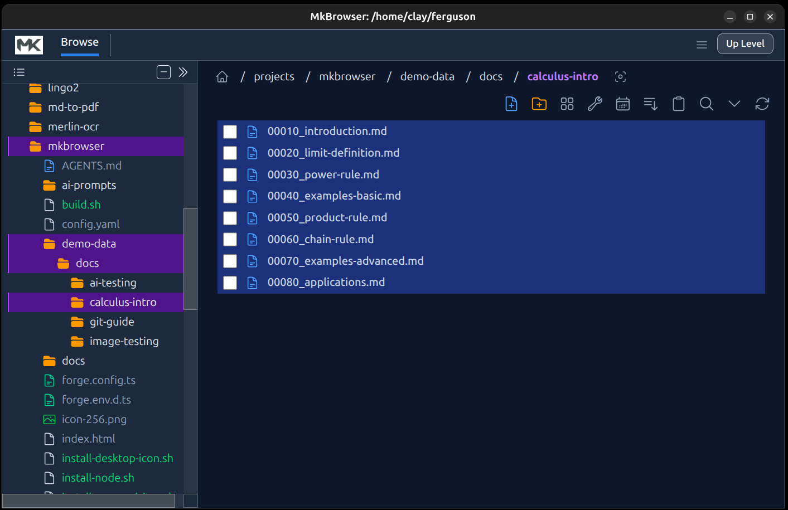
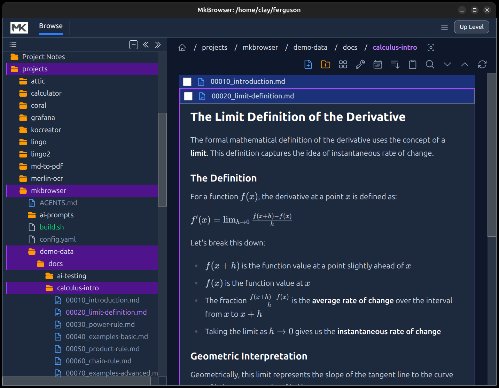
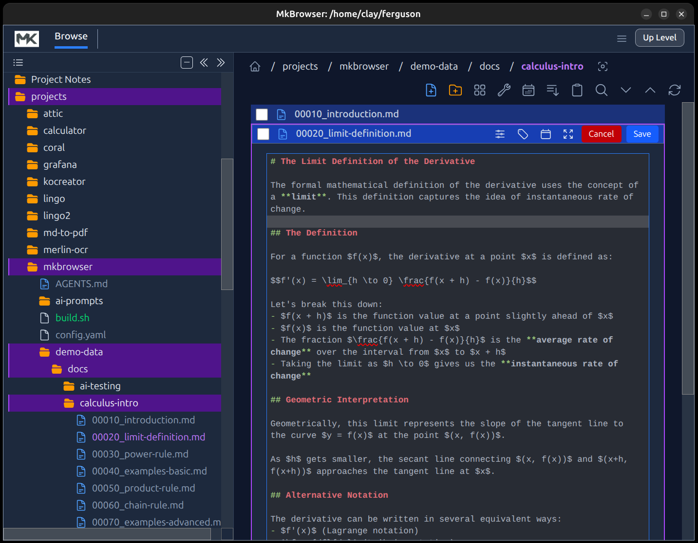
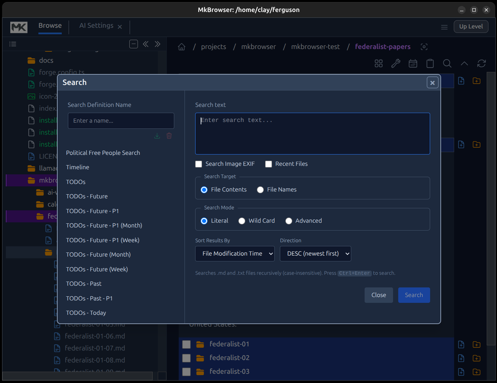
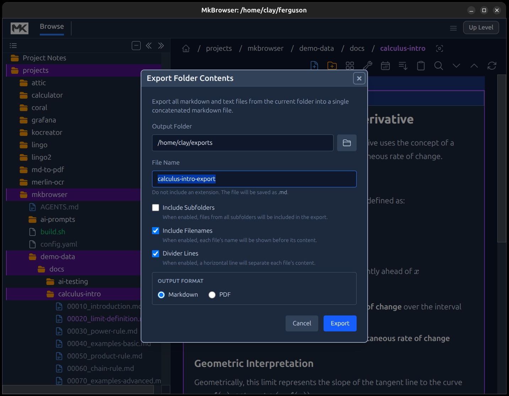
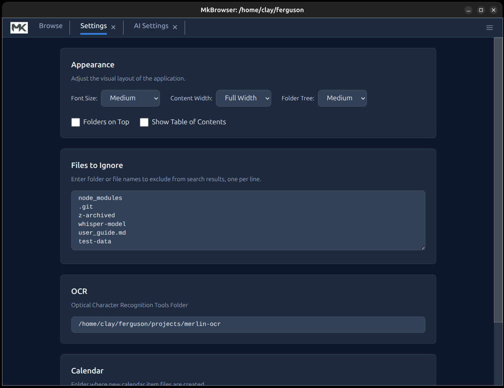

# MkBrowser

MkBrowser is an Electron desktop app that combines a file explorer with inline Markdown rendering, image rendering, and text file editing. It shows a single folder level at a time and renders `.md` files directly within the list rather than using a separate preview pane. 

This README is aimed at developers; a separate [User Guide](docs/USER_GUIDE.md) covers end-user usage. See [Testing](docs/TESTING.md) for details on the test framework and how to write tests. 

*WARNING: This application is only known to work on Linux (developed/test on Ubuntu only)*

## Features (high level)

- Single-level folder browsing (no tree view).
- Inline Markdown rendering directly in the file list.
- In-place Markdown editing with save/cancel flow.
- Multiple files can be edited at once.
- File/folder selection (multi-select) for menu-driven actions.
- Edit menu actions: Cut, Copy, Paste, Delete, Select All.
- Single-click create file from clipboard content.
- Configurable sorting and folders-on-top behavior (file ordering).
- Settings for font size.
- Hidden files filtered out by default (dotfiles).
- Content caching for Markdown to reduce re-reads.
- Search and export dialogs (UI-level support).
- Replace in Files: bulk find-and-replace across all text files.
- PDF export support for Markdown content.
- AI Chatbot supporting Anthropic, OpenAI, Google AI, Ollama Models

## Screenshots

### [Click here for Animated GIFs](docs/img/animated-gifs/about-animated-gifs.md)

### View Files Collapsed


### View Files Expanded


### Editing a File


### Searching


### Export


### Settings


## Tech Stack

- **Runtime**: Electron 40
- **Build tooling**: Electron Forge + Vite
- **Language**: TypeScript
- **UI**: React 19
- **Styling**: Tailwind CSS 4 + Typography plugin
- **Markdown**: `react-markdown`, `remark-math`, `rehype-katex`, KaTeX
- **Editor**: CodeMirror 6
- **Diagrams**: Mermaid
- **Config**: YAML (`js-yaml`)
- **LangChain/LangGraph**: For Local & Cloud API Access
- **Ollama Configs**: Ollama configuration for local LLMs


## Architecture Overview

MkBrowser uses Electron’s three-process architecture and follows a strict IPC boundary. Renderer code never touches the file system directly.

- **Main process**: Owns all file system operations and IPC handlers.
- **Preload**: Exposes a typed `window.electronAPI` surface to the renderer.
- **Renderer**: React UI only, calls `window.electronAPI.*` for any file operations.

Data flow:

Renderer → `window.electronAPI.*` → `ipcRenderer.invoke` → Main process handler → Node.js fs → return to renderer

## State Management

State is handled by a small store built on React’s `useSyncExternalStore` (no Redux/Context). Items are stored in a `Map<path, ItemData>` for O(1) lookups. Store updates create new objects to ensure re-renders.

Key item fields include:
- `isSelected` for multi-select UI
- `content` and `contentCachedAt` for Markdown caching
- `editing` for per-file edit mode (supports multiple concurrent edits)

## Configuration

MkBrowser stores configuration in a YAML file under the user’s config directory. It currently tracks the last browsed folder.

## Development Workflow

### Install

```bash
npm install
```

### Run (Linux)

Linux requires sandbox disablement:

```bash
npm run start:linux
```

### Run (Windows/Mac)

```bash
npm start
```

### Lint

```bash
npm run lint
```

### Package / Make

```bash
npm run package
npm run make
```

## Key Packages

### Runtime Dependencies

- `react`, `react-dom`
- `react-markdown`
- `remark-math`, `rehype-katex`, `katex`
- `codemirror` + `@codemirror/*`
- `mermaid`
- `fdir` (directory scanning)
- `js-yaml`
- `typo-js`

### Dev Dependencies

- `electron`, `@electron-forge/*`
- `vite`, `@vitejs/plugin-react`
- `typescript`
- `tailwindcss`, `@tailwindcss/typography`, `@tailwindcss/vite`
- `eslint` + `@typescript-eslint/*`
- `postcss`, `autoprefixer`

## Project Structure (high level)

- **Main process**: `src/main.ts`
- **Preload**: `src/preload.ts`
- **Renderer entry**: `src/renderer.tsx`
- **UI**: `src/App.tsx` and `src/components/*`
- **State**: `src/store/*`

## Contributing Notes

- All file system access must stay in the main process.
- If you add a new IPC handler, update:
  - `src/main.ts`
  - `src/preload.ts`
  - `src/global.d.ts`
- Keep renderer logic UI-only.
- Tailwind CSS is configured in `src/index.css` (CSS-first setup).


