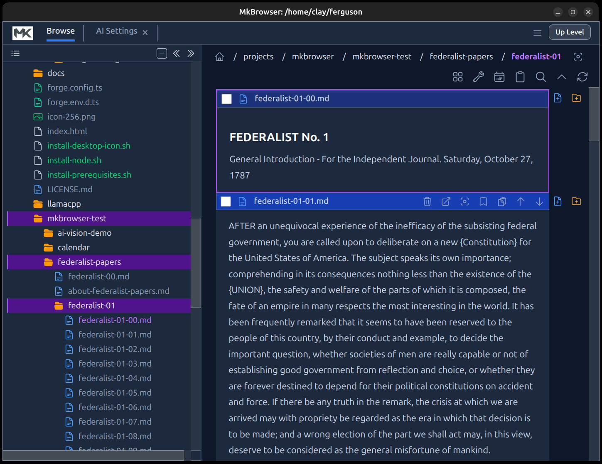
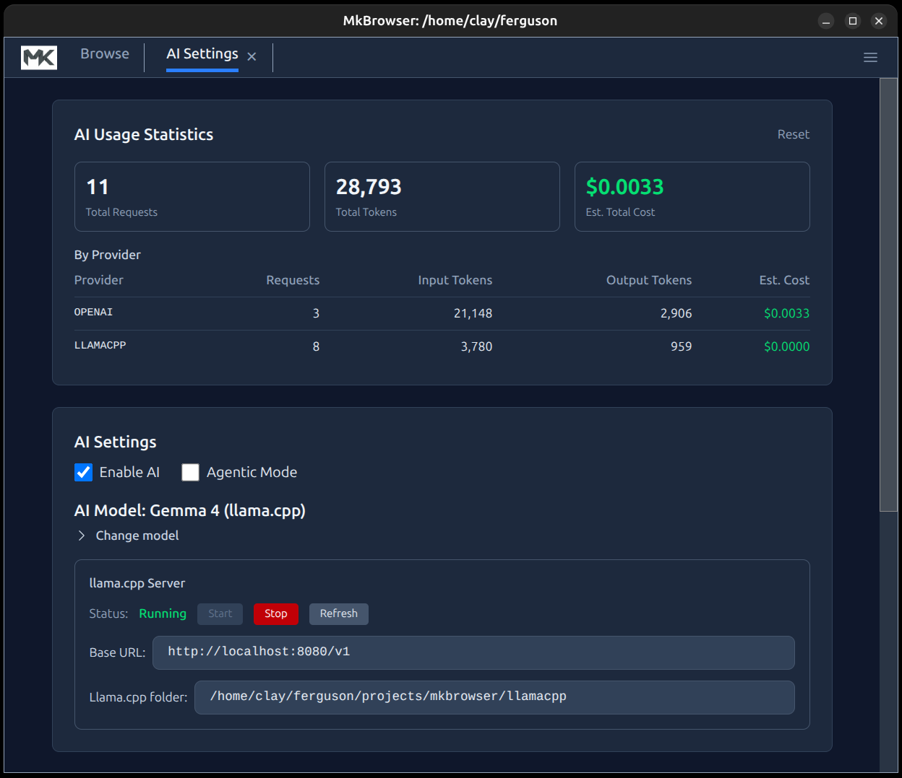
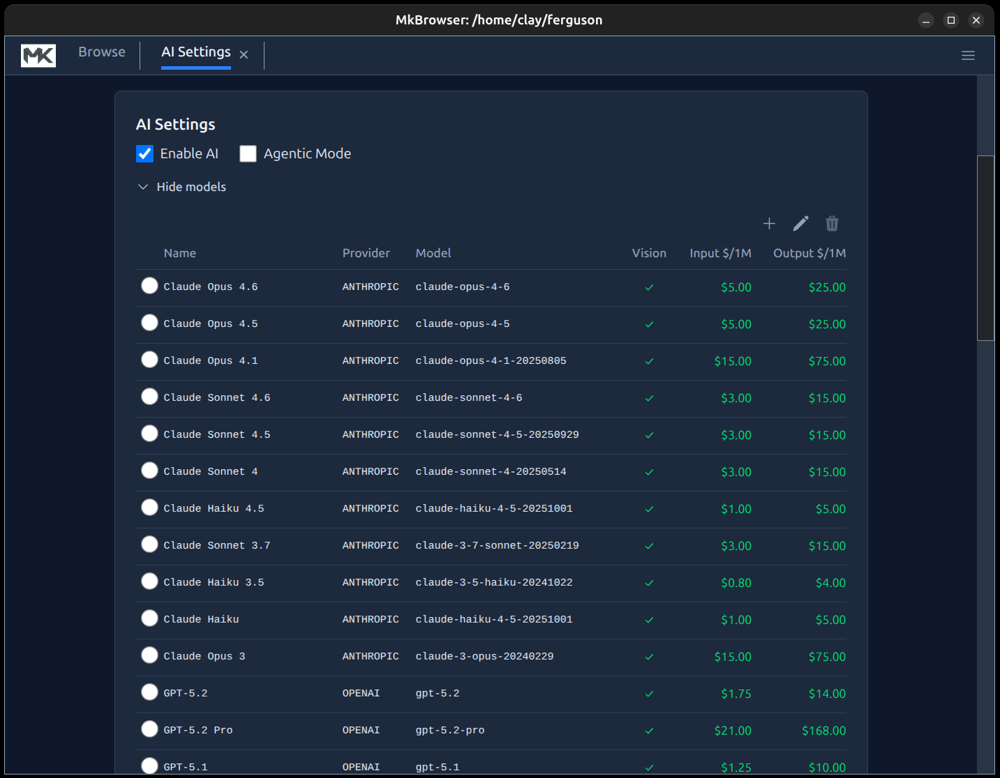
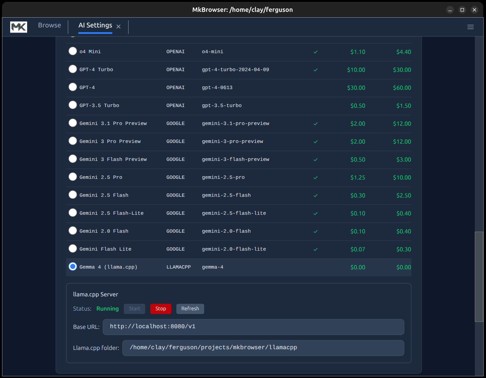

# MkBrowser User Guide 

MkBrowser is a file explorer and Markdown editor that helps you manage Markdown notes with inline rendering.



<!-- TOC -->
* [Desktop Icon (Linux)](#desktop-icon-linux)
* [Browsing and Editing](#browsing-and-editing)
  * [Viewing Content](#viewing-content)
  * [Editing Files](#editing-files)
    * [Editor Keyboard Shortcuts](#editor-keyboard-shortcuts)
  * [Automatic Table of Contents Generation](#automatic-table-of-contents-generation)
  * [Tag Picker](#tag-picker)
    * [Setting up `.TAGS.yaml` files](#setting-up-tagsyaml-files)
  * [Renaming](#renaming)
  * [File Operations (Cut, Copy, Paste, Delete)](#file-operations-cut-copy-paste-delete)
* [Edit Menu Features](#edit-menu-features)
  * [Undo Cut](#undo-cut)
  * [Select All](#select-all)
  * [Unselect All](#unselect-all)
  * [Move to Folder](#move-to-folder)
  * [Split](#split)
  * [Join](#join)
  * [Replace in Files](#replace-in-files)
  * [Cut and Paste](#cut-and-paste)
  * [Delete](#delete)
  * [Split and Join](#split-and-join)
    * [Split](#split-1)
    * [Join](#join-1)
* [Document Mode](#document-mode)
  * [Enabling Document Mode](#enabling-document-mode)
  * [Editing Mode](#editing-mode)
  * [Inserting New Files and Folders](#inserting-new-files-and-folders)
  * [Disabling Document Mode](#disabling-document-mode)
* [Searching](#searching)
  * [Using Search](#using-search)
  * [Advanced Search Predicates](#advanced-search-predicates)
  * [Saving Search Definitions](#saving-search-definitions)
* [Replace in Files](#replace-in-files-1)
  * [Using Replace in Files](#using-replace-in-files)
  * [What Happens](#what-happens)
  * [Results Summary](#results-summary)
  * [Tips](#tips)
* [Folder Analysis](#folder-analysis)
  * [Running an Analysis](#running-an-analysis)
  * [What Gets Scanned](#what-gets-scanned)
  * [Analysis Results](#analysis-results)
  * [The Analysis Tab](#the-analysis-tab)
* [Exporting](#exporting)
* [Markdown Support](#markdown-support)
  * [Column Layout (`|||`)](#column-layout-)
* [Wikilinks](#wikilinks)
  * [Syntax](#syntax)
  * [Examples](#examples)
* [LaTeX Math Support](#latex-math-support)
  * [Syntax](#syntax-1)
  * [Escaping Dollar Signs for Currency](#escaping-dollar-signs-for-currency)
  * [Example](#example)
* [AI Chat](#ai-chat)
  * [Benefits of Folder-based Chat History](#benefits-of-folder-based-chat-history)
    * [1. Complete Transparency](#1-complete-transparency)
    * [2. Full Portability](#2-full-portability)
    * [3. Git-Native Version Control](#3-git-native-version-control)
    * [4. Rich Artifact Responses](#4-rich-artifact-responses)
    * [5. Natural Multi-Agent Support](#5-natural-multi-agent-support)
    * [6. Consensus Systems](#6-consensus-systems)
    * [7. Branching Visibility at a Glance](#7-branching-visibility-at-a-glance)
    * [8. Conversation Search Across Threads](#8-conversation-search-across-threads)
    * [9. Conversation Forking](#9-conversation-forking)
    * [10. Human-Readable Without MkBrowser](#10-human-readable-without-mkbrowser)
    * [11. Minimal Path Depth (H/A Convention)](#11-minimal-path-depth-ha-convention)
    * [12. Implicit Ordering](#12-implicit-ordering)
    * [13. Self-Organizing via System Prompt](#13-self-organizing-via-system-prompt)
    * [14. Attachment-Native](#14-attachment-native)
    * [15. Replay and Export](#15-replay-and-export)
  * [AI Settings](#ai-settings)
    * [Enable AI Features](#enable-ai-features)
    * [AI Model](#ai-model)
    * [llama.cpp Base URL](#llamacpp-base-url)
    * [AI Settings View](#ai-settings-view)
    * [Supported Models](#supported-models)
    * [Agentic Mode](#agentic-mode)
    * [Allowed Folders](#allowed-folders)
    * [API keys for cloud providers](#api-keys-for-cloud-providers)
    * [AI Usage Statistics](#ai-usage-statistics)
  * [Attaching files with `#file:`](#attaching-files-with-file)
    * [Patterns and wildcards](#patterns-and-wildcards)
    * [What gets sent to the AI](#what-gets-sent-to-the-ai)
  * [AI Rewrite](#ai-rewrite)
    * [How to use Rewrite](#how-to-use-rewrite)
    * [Rewriting a Selection](#rewriting-a-selection)
    * [Full Document Context](#full-document-context)
    * [Customizing the Rewrite Prompt](#customizing-the-rewrite-prompt)
* [Automatic Markdown-to-HTML Export (Front Matter Autogen)](#automatic-markdown-to-html-export-front-matter-autogen)
  * [How It Works](#how-it-works)
  * [Use Case: Browser Landing Page](#use-case-browser-landing-page)
  * [Technical Details](#technical-details)
<!-- /TOC -->

# Desktop Icon (Linux)

To add MkBrowser to your application launcher on Ubuntu/GNOME so you can pin it to your dock:

1. Run the install script from the project directory:
   ```bash
   ./install-desktop-icon.sh
   ```
2. This creates a `.desktop` file in `~/.local/share/applications/` that launches MkBrowser using the `mk-browser` command.
3. Open your application launcher (Activities / Show Applications) and find **MkBrowser**.
4. Right-click the icon and choose **Add to Favorites** to pin it to your dock.


# Browsing and Editing

MkBrowser displays your files and folders in a single streamlined list.

## Viewing Content
- **Markdown Files**: Click on any `.md` file to expand it and view its rendered content directly in the list. You don't need to open a separate preview pane.
- **Images**: Click on image files to preview them inline.
- **Folders**: Click on a folder to navigate into it.

## Running Shell Scripts

Any file with a `.sh` extension appears in the file tree and can be launched directly from within MkBrowser.

- **Ctrl+Click** on any `.sh` file name to execute it as a shell script. The script runs immediately and opens in its own terminal window at the operating system level, so you can see its output and interact with it.

### Suppressing the Terminal Window

If you want the script to run silently in the background without a visible console window, add the following directive somewhere near the top of the script file (typically after the shebang line):

```bash
# Terminal=false
```

When MkBrowser detects this directive, it executes the script without opening a terminal window.

## Editing Files
When a Markdown file is expanded, you can edit its content:
1. Click the **Edit** button (pencil icon) in the top-right corner of the file card.
2. The view switches to a code editor where you can make changes.
3. Press `Save` button or use `Ctrl+S` / `Cmd+S` to save your changes.
4. Click the **Close** button (X icon) to return to the rendered view.

### Editor Keyboard Shortcuts

While the code editor has focus, the following keyboard shortcuts are available:

| Shortcut | Action |
|----------|--------|
| `Esc` | Exit editing — only works if you have **not** made any changes to the file. |
| `Ctrl+Q` | Abandon editing — discards all unsaved changes and exits without prompting. |
| `Ctrl+S` | Save and exit — saves your changes to disk and returns to the rendered view. |

## Automatic Table of Contents Generation

MkBrowser can automatically generate and maintain a **Table of Contents** for any Markdown file. All you need to do is place the following HTML comment anywhere in your file:

```
<\!-- TOC -->
```

That's it. Whenever you save the file, MkBrowser will replace that placeholder with a fully generated table of contents, using every heading in the document (up to three levels deep). The result looks like this:

```
<\!-- TOC -->

* [Introduction](#introduction)
* [Getting Started](#getting-started)
  * [Installation](#installation)
  * [Configuration](#configuration)
* [Advanced Usage](#advanced-usage)

<\!-- /TOC -->
```

On your next save, MkBrowser will regenerate the TOC in place, keeping it in sync with any heading changes you made.

**While editing**, the full TOC block is hidden — the editor shows only the original `<\!-- TOC -->` placeholder so it stays out of your way. The complete TOC is restored as soon as you save.

If your file has no `<\!-- TOC -->` comment, nothing happens. If it has headings but none at the configured depth, or no headings at all, the file is saved unchanged.

## Tag Picker

While editing a Markdown file, a **tag picker** appears below the editor. It shows a row of clickable checkboxes — one for each hashtag defined in any `.TAGS.yaml` file(s) found in the file's ancestor directories. You can use it to quickly add or remove hashtags from the file you are editing without typing them by hand. Tags are added into the 'tags' property of the Markdown Front Matter, creating a Front Matter section as necessary. NOTE: This is identical to the "Obsidian" way of storing tags.

- **Checked** tags are already present somewhere in the file's content and are highlighted in blue.
- **Unchecked** tags are not currently in the content.
- Clicking an unchecked tag **appends** it to the end of the content.
- Clicking a checked tag **removes** all occurrences of that tag from the content.
- **Hover** over any tag to see its description.

The checkboxes stay in sync with the editor as you type, so you can freely mix typing and clicking.

### Setting up `.TAGS.yaml` files

The tag picker gets its list of available tags from `.TAGS.yaml` files placed in your folder tree. When you open a file for editing, MkBrowser walks up through that file's ancestor directories and reads every `.TAGS.yaml` it finds. The tags defined in those files become the options in the tag picker. Tags are sorted alphabetically.

**Example:** if your notes folder structure is:

```
~/notes/
  .TAGS.yaml          ← defines #project #personal #archive
  work/
    .TAGS.yaml        ← defines #meeting #action-item
    q1-review.md
```

When editing `q1-review.md`, the tag picker will show all five tags: `#project`, `#personal`, `#archive`, `#meeting`, `#action-item`, sorted alphabetically. If the same tag name is defined in more than one file, the definition from the furthest ancestor wins.

**To create a `.TAGS.yaml` file**, create a new file named `.TAGS.yaml` in any folder using the following format:

```yaml
# Hashtag Configuration File
hashtags:
  project:
    description: |
      Use for anything related to an active project.
    group: category
  personal:
    description: |
      Personal notes and reminders.
    group: category
  archive:
    description: |
      Content that is finished and no longer active.
    group: category
  p1:
    description: |
      Highest priority — needs immediate attention.
    group: priority
  p2:
    description: |
      Medium priority.
    group: priority
  p3:
    description: |
      Low priority.
    group: priority
  done:
    description: |
      Completed items.
```

Each key under `hashtags` is a tag name (without the `#` — MkBrowser adds it automatically). Each tag has two properties: `description` (shown as a tooltip when you hover) and the optional `group` (a string that identifies a set of mutually exclusive tags — tags sharing the same group name will eventually support radio-button-style selection).

If no `.TAGS.yaml` files are found anywhere in the ancestor tree, the tag picker is hidden entirely.

## Renaming
You can rename any file or folder:
- **Button**: Click the **Rename** button (pencil icon on the folder row) next to the item.
- **Double-click**: Double-click the file or folder name text.
- Enter the new name and press `Enter` to confirm, or `Esc` to cancel.

## File Operations (Cut, Copy, Paste, Delete)
You can manage your files using the application menu or keyboard shortcuts.
- **Selection**: 
    - Click the checkbox next to any file or folder to select it.
    - Select multiple items to perform batch operations.
    - Use **Select All** from the **Edit** menu to select all items in the current folder.
- **Delete**: 
    - Select items and click the **Trash** icon or press the `Delete` key.
- **Cut/Paste**:
    - Select items and choose **Cut** from the **Edit** menu to move files.
    - Navigate to the destination folder and choose **Paste**.

# Edit Menu Features

The **Edit** menu provides a set of tools for managing and manipulating your files and selections. Below are the main features available:

## Undo Cut
Restores items that were previously marked as "cut" (for moving) back to their original state, cancelling the pending move operation. Use this if you change your mind after cutting items but before pasting them.

## Select All
Selects all files and folders in the current directory, making it easy to perform batch operations like cut, copy, or delete.

## Unselect All
Clears all current selections in the file list, so no items remain selected.

## Move to Folder
Moves a selected file into a new folder with the same base name (minus extension). For example, selecting `chapter1.md` and choosing **Move to Folder** will create a folder named `chapter1` and move the file inside it. Only available when exactly one file is selected. 

## Split
See [Split and Join](#split-and-join) for full details. Splits a single text or Markdown file into multiple files at each double blank line (two consecutive empty lines). The new files are named with numeric suffixes to preserve order.

## Join
See [Split and Join](#split-and-join) for full details. Combines two or more selected text or Markdown files into a single file, inserting double blank lines between each file's content. The result is saved to the alphabetically first file, and the others are deleted after joining.

## Replace in Files
See [Replace in Files](#replace-in-files) for details. Opens a dialog to search and replace text across all `.md` and `.txt` files in the current folder and subfolders.


## Cut and Paste

The **Cut** operation allows you to move files and folders to a new location. To use it:

1. Select one or more items in the Browse view by clicking the checkboxes next to each file or folder.
2. When items are selected, a **Cut** button appears at the top of the page. Click it to mark the selected items for moving.
3. Once items have been cut, various **Paste** icons will appear throughout the application—anywhere a folder is a valid paste destination.
4. Click a **Paste** icon next to your desired destination folder to move the cut items there.

**Notes:**
- You can only paste into folders where the operation is valid (e.g., not into the same folder the items came from, and not if it would create duplicates).
- After pasting, the items are moved to the new location and removed from their original folder.
- If you change your mind after cutting but before pasting, use **Undo Cut** from the Edit menu to cancel the operation.

## Delete

The **Delete** operation lets you remove files and folders from your workspace. There are two ways to delete:

1. **Single item:** Click the **Delete** (trash) icon next to any file or folder to delete just that item.
2. **Multiple items:** Select multiple items using the checkboxes, then click the **Delete** button that appears at the top of the page when items are selected. All selected items will be deleted in one action.

**Notes:**
Deleted files go into your operating system trash bin rather than being permanently deleted.

## Split and Join

MkBrowser provides **Split** and **Join** operations to help you break apart large files or combine multiple files into one. These features work with text (`.txt`) and Markdown (`.md`) files.

### Split

The **Split** feature divides a single file into multiple smaller files using a double blank line as the delimiter.

**How to use Split:**

1. Click the checkbox next to the text or Markdown file you want to split (select exactly one file).
2. Go to **Edit → Split** in the menu bar.
3. The file will be divided at each occurrence of a **double blank line** (two consecutive empty lines).

**What happens:**

- The original file is renamed with a `-00` suffix (e.g., `my-notes.md` becomes `my-notes-00.md`).
- Each subsequent section becomes a new file with incrementing numbers: `my-notes-01.md`, `my-notes-02.md`, etc.
- The numbered suffixes ensure files sort alphabetically in the correct order.

**Example:**

If you have a file `chapter.md` with this content:

```
# Part One

This is the first section.


# Part Two

This is the second section.


# Part Three

This is the third section.
```

After splitting, you'll have three files:
- `chapter-00.md` containing "# Part One..."
- `chapter-01.md` containing "# Part Two..."
- `chapter-02.md` containing "# Part Three..."

**Requirements:**
- Exactly one file must be selected.
- The file must be a `.txt` or `.md` file.
- The file must contain at least one double blank line (the delimiter).

### Join

The **Join** feature combines multiple files into a single file, inserting a double blank line between each file's content.

**How to use Join:**

1. Click the checkboxes next to two or more text or Markdown files you want to combine.
2. Go to **Edit → Join** in the menu bar.
3. The files will be merged into a single file.

**What happens:**

- Files are sorted alphabetically by filename before joining.
- The content of all files is concatenated with a **double blank line** (`\n\n\n`) separator between each file's content.
- The combined content is written to the alphabetically first file.
- The other files are deleted (only after verifying the write succeeded).

**Example:**

If you select these three files:
- `notes-00.md` (content: "First part")
- `notes-01.md` (content: "Second part")
- `notes-02.md` (content: "Third part")

After joining, only `notes-00.md` remains, containing:

```
First part


Second part


Third part
```

**Requirements:**
- At least two files must be selected.
- All selected items must be files (not folders).
- All files must be `.txt` or `.md` files.

**Safety:** The Join operation verifies that the combined content was written correctly by checking the file size before deleting the other files. This ensures no data is lost.

# Document Mode

Document Mode lets you treat any specific folder as a structured document, where each file (or subfolder) in that folder represents a block of content, in the context of a larger document, represented by the whole folder. Instead of files/folders appearing in some arbitrary filesystem order, `Document Mode` gives you full control over the sequence — so you can arrange your content exactly as it should read as a "Document". This block-based approach to editing will be familiar to people who have used Jupyter Notebooks because it's a similar concept.

This is useful any time a folder represents something with a meaningful order: a book where each chapter is a file, a course where each lesson is a subfolder, a report broken into sections, or any collection where sequence matters.

## Enabling Document Mode

1. Navigate into the folder you want to treat as a document.
2. Open the **Sort** menu (the sort button in the toolbar).
3. Click **Enable Docment Mode** at the bottom of the menu.

MkBrowser will immediately switch the folder into Document Mode. A hidden file named `.INDEX.yaml` is created in that folder — this file records and maintains the display order of all the entries. You don't need to edit this file directly; MkBrowser manages it for you automatically. Once Document Mode is enabled you will no longer see the "Sort" menu because files are treated like paragraphs in a document and are in a fixed order defined by you. If you want to to back to making the folder behave like a normal folder (not a Document) then you must manually delete the `.INDEX.yaml` file from your file system, which you can safely do, and the only thing you will lose is the ordering of the files, which you no longer want.

## Editing Mode

By default, Document Mode displays your content in a read-only view. To reveal the controls for rearranging and creating content, enable editing:

- Check the **Edit** checkbox in the folder's toolbar.

With editing enabled, the following controls appear on each entry:

- **Move Up** (arrow up icon): Moves the file or folder one position earlier in the document order.
- **Move Down** (arrow down icon): Moves the file or folder one position later.
- **Ctrl + Move Up**: Moves the entry all the way to the top of the list in one click.
- **Ctrl + Move Down**: Moves the entry all the way to the bottom of the list in one click.

## Inserting New Files and Folders

When editing is enabled, **insert bars** appear between every pair of entries (and at the very top of the list). Each insert bar has two icon buttons:

- **Create File here** — opens the new-file dialog and inserts the file at that exact position.
- **Create Folder here** — opens the new-folder dialog and inserts the folder at that position.

This lets you add new content at any point in the document without having to move things around afterwards.

## Disabling Document Mode

If you want to go back to treating the folder as ordinary files — with normal sort options — you can disable Document Mode by deleting the `.INDEX.yaml` file from the folder.

You can do this from within MkBrowser (enable editing, then delete the file using the trash icon) or from your operating system's file manager or terminal. Once `.INDEX.yaml` is gone, the folder returns to standard sort behavior.

# Searching

MkBrowser includes a powerful search feature to help you find content across your notes.

## Using Search
1. Click the **Search** button in the toolbar or press `Ctrl+Shift+F`.
2. Enter your search query.
3. Choose your search options:
    - **Search Target**: Choose to search **File Content** or **File Names**.
    - **Search Mode**: 
        - **Literal**: Exact text match.
        - **Wildcard**: Use `*` to match any characters (e.g., `note-*.md`).
        - **Advanced**: Use custom predicate functions (see below).

## Advanced Search Predicates
In **Advanced Mode**, you can write JavaScript-like expressions to filter files. The following custom functions and variables are available:

*   **`$('text')`**: Returns `true` if the file content contains the text "text" (case-insensitive).
    *   Example: `$('important')` finds files containing "important".
*   **`ts`**: A pre-existing variable containing the first date/timestamp found in the file (format: MM/DD/YYYY). Returns a number representing the date in milliseconds, or 0 if no timestamp is found.
*   **`past(date, lookbackDays?)`**: Returns `true` if the date is in the past. The optional `lookbackDays` parameter limits results to timestamps within the specified number of days ago (e.g., `past(ts, 7)` matches timestamps from the last 7 days).
*   **`future(date, lookaheadDays?)`**: Returns `true` if the date is in the future. The optional `lookaheadDays` parameter limits results to timestamps within the specified number of days ahead (e.g., `future(ts, 30)` matches timestamps within the next 30 days).
*   **`today(date)`**: Returns `true` if the date is today.
*   **`prop(propertyPath)`**: Returns the value of the property at `propertyPath` from the file's YAML front matter, or `undefined` if not found. Use dot-notation to reach nested properties (e.g. `'author.name'`).
*   **`inList(propertyPath, value)`**: Returns `true` if the file's YAML front matter has a list property at `propertyPath` that contains `value` as one of its items. Use dot-notation to reach nested properties.

**Examples:**
*   Find files with "TODO" that are due in the future:
    ```javascript
    $('#TODO') && future(ts)
    ```
*   Find files with "Meeting" that happened in the past:
    ```javascript
    $('#meeting') && past(ts)
    ```
*   Find files with "TODO" due within the next 7 days:
    ```javascript
    $('#TODO') && future(ts, 7)
    ```
*   Find files with "Review" from the last 30 days:
    ```javascript
    $('#review') && past(ts, 30)
    ```
*   Find files containing both "project" and "urgent":
    ```javascript
    $('#project') && $('#urgent')
    ```
*   Find files whose front matter `category` property is `sports`:
    ```javascript
    prop('category') == 'sports'
    ```
    Matches files with front matter like:
    ```markdown
    ---
    category: sports
    ---
    ```
*   Find files with a nested front matter property, e.g. `author.role` set to `editor`:
    ```javascript
    prop('author.role') == 'editor'
    ```
    Matches files with front matter like:
    ```markdown
    ---
    author:
      name: Jane
      role: editor
    ---
    ```
*   Find files whose `tags` list contains `p1`:
    ```javascript
    inList('tags', 'p1')
    ```
    Matches files with front matter like:
    ```markdown
    ---
    tags:
      - bill
      - p1
      - to-buy
    ---
    ```
*   Combine `inList` with a content search — files tagged `urgent` that also mention "deadline":
    ```javascript
    inList('tags', 'urgent') && $('#deadline')
    ```

## Saving Search Definitions
You can save frequently used searches for quick access later.

1. In the Search dialog, enter your search query and configure the options.
2. Type a name for your search in the **Search Name** field.
3. Click **Search** to execute and save the definition.

Once saved, your search definitions appear in the **Search** menu on the application's main menu bar (sorted alphabetically). Simply click a saved search to execute it immediately.

**Tip:** Hold **Ctrl** while clicking a search menu item to open the Search dialog with that definition pre-filled. This allows you to review the search parameters before running it, or to edit and update the saved definition.

# Replace in Files

MkBrowser includes a **Replace in Files** feature that allows you to find and replace text across all Markdown (`.md`) and text (`.txt`) files in the current folder and all subfolders.

## Using Replace in Files

1. Navigate to the folder where you want to perform the replacement.
2. Go to **Edit → Replace in Files** in the menu bar.
3. In the dialog that appears:
   - **Search for**: Enter the exact text you want to find.
   - **Replace with**: Enter the replacement text (can be empty to delete matches).
4. Click **Replace** to perform the replacement, or **Cancel** to close the dialog.

## What Happens

- The replacement searches recursively through all subfolders.
- Only `.md` and `.txt` files are processed.
- All occurrences of the search text are replaced (not just the first occurrence in each file).
- The search is **case-sensitive** and matches **exact text** only.
- Files configured in your **Ignored Paths** setting (see Settings) are skipped.

## Results Summary

After the replacement completes, a dialog will show you:
- The total number of replacements made.
- The number of files that were modified.
- If any files could not be processed, you'll see a count of failed files.

**Example:**
> "Replaced 15 occurrences in 4 files."

## Tips

- **Preview first**: Use the Search feature to find matches before replacing, so you know what will be changed.
- **Backup**: For large-scale replacements, consider backing up your folder first.
- **Special characters**: The search treats your text literally—special characters like `*`, `.`, or `?` are matched exactly as typed, not as wildcards or patterns.

# Folder Analysis

MkBrowser can analyze the contents of the current folder to provide useful statistics about your notes. Currently, the analysis extracts and counts all **hashtags** found across your Markdown and text files.

## Running an Analysis

1. Navigate to the folder you want to analyze.
2. Go to **Tools → Folder Analysis** in the menu bar.
3. The analysis will immediately scan all `.md` and `.txt` files recursively (including subfolders), then display the results in the **Analysis** view.

## What Gets Scanned

- All `.md` and `.txt` files in the current folder and all subfolders are included.
- Files and folders matching your **Ignored Paths** setting (see Settings) are skipped.
- The scan extracts hashtags — words starting with `#` followed by letters, numbers, underscores, or hyphens (e.g., `#project`, `#in-progress`, `#v2`).

## Analysis Results

The Analysis view shows:

- **Total files scanned**: The number of `.md` and `.txt` files that were processed.
- **Hashtag list**: Every unique hashtag found, sorted by frequency (most common first). Each entry shows the hashtag name and its total number of occurrences across all scanned files.

## The Analysis Tab

After running an analysis, an **Analysis** tab appears in the tab bar at the top of the application (alongside Browse, Search, and Settings). You can switch between tabs freely — the analysis results are preserved until you run a new analysis or close the application.

**Note:** The Analysis tab only appears after you've run at least one analysis. It is not shown on a fresh application start.

# Exporting

You can export the contents of the current folder into a single document.

1. Click the **Export** button in the toolbar.
2. Configure the export settings:
    - **Output Folder**: Choose where to save the exported file.
    - **File Name**: Name the output file.
    - **Include Subfolders**: Check this to include content from all subfolders recursively.
    - **Include File Names**: Adds the filename as a header before each file's content.
    - **Include Dividers**: Adds a visual separator between files.
    - **Export to PDF**: If checked, the application will attempt to generate a PDF file instead of a Markdown file.
3. Click **Export** to finish.

# Markdown Support

MkBrowser renders Markdown using **GitHub Flavored Markdown (GFM)**, which includes tables, strikethrough, task lists, and autolinks. On top of standard GFM, the following extended features are supported:

- **LaTeX math** — inline (`$...$`) and block (`$$...$$`) equations via KaTeX (see [LaTeX Math Support](#latex-math-support) below).
- **Wikilinks** — `[[filename]]` and `[[filename|alias]]` syntax for linking between files (see [Wikilinks](#wikilinks) below).
- **Syntax highlighting** — fenced code blocks with a language tag (e.g., ` ```python `) are rendered with syntax colors.
- **Mermaid diagrams** — fenced code blocks tagged ` ```mermaid ` are rendered as diagrams.
- **Escaped dollar signs** — use `\$` to display a literal `$` without triggering math mode.

## Column Layout (`|||`)

Placing `|||` on a line by itself within a Markdown file designates a column break. MkBrowser will split the document at each such delimiter and render the resulting sections side-by-side in an equal-width multi-column layout. Other Markdown renderers that are unaware of this convention will display `|||` as plain text.

# Wikilinks

MkBrowser supports wikilink syntax, a popular convention (used by Obsidian, Notion, and other tools) for linking between files using double square brackets. Wikilinks are automatically converted into standard Markdown links when rendered.

## Syntax

- **Basic link**: `[[filename]]` — creates a link to the file, displayed as the filename.
- **Link with alias**: `[[filename|My Description]]` — creates a link to the file, displayed as "My Description".
- **Link to section**: `[[filename#section]]` — creates a link to a specific section heading within the file.
- **Section link with alias**: `[[filename#section|description]]` — creates a link to a section, displayed as "description".

## Examples

| You write | Rendered as |
|-----------|-------------|
| `[[readme]]` | A clickable link labeled "readme" pointing to `readme` |
| `[[notes.md\|My Notes]]` | A clickable link labeled "My Notes" pointing to `notes.md` |
| `[[guide#installation]]` | A clickable link labeled "guide#installation" pointing to the "installation" section of `guide` |
| `[[guide#installation\|Setup]]` | A clickable link labeled "Setup" pointing to the "installation" section of `guide` |

Clicking a wikilink navigates to the linked file, just like clicking any other Markdown link in MkBrowser.

# LaTeX Math Support

MkBrowser supports rendering mathematical equations using LaTeX syntax via KaTeX, compatible with GitHub's math rendering.

## Syntax

- **Inline Math**: Wrap your equation in single dollar signs: `$equation$`
  - Example: `$f(x)$` renders as an inline formula
  
- **Block Math**: Use double dollar signs on separate lines for display equations:
  ````
  $$
  equation
  $$
  ````

## Escaping Dollar Signs for Currency

Since `$` is used for math delimiters, use the standard LaTeX escape `\$` to display literal dollar signs (e.g., for monetary values):

| You type | Renders as |
|----------|------------|
| `\$100` | $100 |
| `\$49.99` | $49.99 |
| `$x^2$` | *x²* (math) |

This is the same escape convention used in traditional LaTeX and is compatible with most Markdown-with-math systems.

## Example

Here's how to write the calculus limit definition:

````markdown

# Calculus Limit Definition

For a function $f(x)$, the derivative at a point $x$ is defined as:

$$
f'(x) = \lim_{h \to 0} \frac{f(x + h) - f(x)}{h}
$$

This course costs \$99.
````

**Rendered output:**

For a function $f(x)$, the derivative at a point $x$ is defined as:

$$
f'(x) = \lim_{h \to 0} \frac{f(x + h) - f(x)}{h}
$$

This course costs $99.

# AI Chat

MkBrowser includes an integrated AI chat feature that organizes each conversation into a folder-based history. Each turn in the conversation is saved in its own folder as the chat progresses: your prompt is written to `HUMAN.md`, and MkBrowser saves the AI's reply to `AI.md`. When using a reasoning model (such as Gemma 4), MkBrowser also saves the model's internal chain-of-thought to `THINK.md` alongside the reply, so you can see exactly how the model arrived at its answer.

## Benefits of Folder-based Chat History

### 1. Complete Transparency
Conversations are plain files and folders. No database, no proprietary format. Inspect any conversation with `ls` and `cat`. Nothing is hidden.

### 2. Full Portability
Archive a conversation with `tar` or `zip`. Copy it to another machine. Email it. Put it on a USB drive. No export step needed — the filesystem IS the format.

### 3. Git-Native Version Control
Every conversation is diffable, branchable, and recoverable with standard Git. You get full history for free. Teams can collaborate on conversations via pull requests.

### 4. Rich Artifact Responses
The AI's response isn't trapped in a text box. It can be an entire project structure — source code, tests, documentation, configuration files. Ask "build me a React component with tests" and get a folder you can immediately run.

### 5. Natural Multi-Agent Support
Branching (sibling `A`, `A1`, `A2` folders) makes multi-agent workflows native rather than bolted-on. Send the same prompt to Claude and GPT-4, get separate response folders, compare them side-by-side.

### 6. Consensus Systems
A third AI agent can be given two sibling response folders and asked to evaluate, compare, or synthesize them. The multi-agent branching structure makes this architecturally natural.

### 7. Branching Visibility at a Glance
Listing a directory immediately reveals whether a conversation branched. Seeing `A` and `A1` means two agent replies exist. Seeing `H` and `H1` means the human rephrased. No metadata needed to detect this.

### 8. Conversation Search Across Threads
MkBrowser's existing search infrastructure (literal, wildcard, advanced modes) works immediately across all conversations. "Find every time Claude suggested using a factory pattern" is just a content search over `AI.md` files.

### 9. Conversation Forking
"I liked where this was going at turn 5 but turn 7 went off the rails" — copy turns 1–5 into a new conversation root and continue. Filesystem copy makes this trivial.

### 10. Human-Readable Without MkBrowser
Even without the application, conversations are fully navigable and readable in any file manager or terminal. The design degrades gracefully to the simplest possible tools.

### 11. Minimal Path Depth (H/A Convention)
Single-character folder names maximize the number of turns before hitting filesystem path limits. Linear conversations use bare `H`/`A` (zero overhead). Numbering only appears when branching actually occurs, costing characters only when disambiguation is genuinely needed.

### 12. Implicit Ordering
The parent-child relationship encodes turn order. Walking `..` from any folder reconstructs the exact conversation lineage without ambiguity — no manifest file needed for linear threads.

### 13. Self-Organizing via System Prompt
The AI maintains the conversation structure itself via tools, guided by the system prompt. This minimizes custom code and lets the protocol evolve by editing a prompt rather than rewriting application logic.

### 14. Attachment-Native
Multimodal prompts are natural — drop images, PDFs, or any files alongside `HUMAN.md` or `AI.md` and they're included in the prompt. No special upload UI needed.

### 15. Replay and Export
A flattener can walk the folder tree and produce a single Markdown document (for sharing), or convert to OpenAI/Anthropic conversation format (for fine-tuning or migration).

## AI Settings

All AI-related configuration lives in **Settings → AI Settings**.

### Enable AI Features

Turn on **Enable AI Features** to show AI chat features in the UI.

If this is off:

- AI chat features are hidden/disabled.
- Agentic Mode, model selection, and usage statistics are not shown.

### AI Model

Use the **AI Model** dropdown to pick which model MkBrowser will use for chat.

MkBrowser stores a list of named model entries; each entry has:

- **Name**: A friendly label shown in the dropdown (e.g. “Claude Haiku”).
- **Provider**: One of `ANTHROPIC`, `OPENAI`, `GOOGLE`, or `LLAMACPP`.
- **Model**: The provider's model identifier string (e.g. `claude-3-haiku-20240307`, `gpt-4.1-nano`, `gemini-2.0-flash-lite`, or a llama.cpp model name).

#### Create / Edit / Delete models

Next to the model dropdown are three small icon buttons:

- **Create** (plus icon): Create a new model entry.
- **Edit** (pencil icon): Edit the currently selected model entry.
- **Delete** (trash icon): Delete the currently selected model entry.

When you create or edit a model, you’ll be asked for:

- **Name**
- **Provider**
- **Model**

If you try to create a new entry with the same **Name** as an existing entry, MkBrowser will prompt you to confirm overwriting the existing one.

### llama.cpp Base URL

The **llama.cpp Base URL** field is only shown when the selected model's **Provider** is `LLAMACPP`.

- Default: `http://localhost:8080/v1`
- Change this if your llama-server is running on a different host or port.

This setting is saved when the field loses focus (click away / tab out).

### AI Settings View



### Supported Models




### Agentic Mode

When **Agentic Mode** is enabled, MkBrowser allows the AI to call built-in tools that interact with your file system while it is generating a response.

In this project, the agent tools include:

- Reading and listing files/folders
- Writing/creating files
- Deleting files and folders

When Agentic Mode is disabled, the AI runs in a simpler “non-agentic” mode (no tool-calling) and can only respond based on the prompt content and any attachments you included.

### Allowed Folders

**Allowed Folders** is only shown when Agentic Mode is enabled.

Enter **one absolute path per line**. The AI’s file tools are restricted to paths under these folders.

Notes:

- If the list is empty, file tools will be denied.
- Use this to scope access tightly (for example, only your notes folder or a dedicated project folder).

### API keys for cloud providers

For cloud providers (`ANTHROPIC`, `OPENAI`, `GOOGLE`), authentication is done via environment variables at app launch.

Common environment variables:

- `ANTHROPIC_API_KEY`
- `OPENAI_API_KEY`
- `GOOGLE_API_KEY`

MkBrowser does not currently provide UI fields for entering API keys.

### AI Usage Statistics

After you make at least one AI request, an **AI Usage Statistics** section appears in Settings.

It shows:

- **Total Requests**
- **Total Tokens** (input + output)
- **Estimated Total Cost**
- A per-provider breakdown of requests, tokens, and estimated cost

Use **Reset** to clear the saved usage stats. This cannot be undone.


## Attaching files with `#file:`

MkBrowser supports a lightweight “attachment directive” you can put directly into your prompt.

If a line in `HUMAN.md` matches this format:

```markdown
#file:<pattern>
```

MkBrowser will try to match files in the **current conversation folder** (the same folder that contains the `HUMAN.md` you’re editing), read the matched files, and embed their contents into the prompt that is sent to the model.

### Patterns and wildcards

- Patterns are matched against **filenames in the current folder** (non-recursive).
- `*` is supported as a wildcard (matches any sequence of characters).
- Patterns are **relative to the current folder**. In practice, this means you should use filenames like `notes.md` or patterns like `*.md` — not paths into subfolders.

Examples:

```markdown
#file:notes.md
#file:*.md
#file:diagram-*.mmd
```

You can include multiple `#file:` lines; matches are deduplicated.

### What gets sent to the AI

- The `#file:` lines themselves are removed from the prompt text.
- Matched **text files** are appended to the prompt in an `<attached_files>` block (each file is wrapped in a `<file ...>` tag).
- Matched **image files** (like `.png`, `.jpg`, `.gif`, etc.) are attached as images (for models that support vision).

Notes:

- `HUMAN.md` is never attached (even if you try to match it).
- If a pattern matches zero files, it’s silently ignored.

## AI Rewrite

MkBrowser includes an AI-powered **Rewrite** feature that can improve the content you're currently editing. When you have a Markdown or text file open in the editor, a **Rewrite** button appears in the toolbar alongside the Save and Cancel buttons.

### How to use Rewrite

1. Open a file for editing by clicking the **Edit** button (pencil icon).
2. Write or modify your content in the editor.
3. Click the **Rewrite** button. 
4. When the AI finishes, a **diff review editor** appears showing your original text alongside the AI's suggested changes, with additions and deletions highlighted.
5. Review the changes, then:
   - Click **Accept All** to replace your editor content with the rewritten version.
   - Click **Cancel Rewrite** to discard the suggestions and keep your original text.
6. After accepting, you can continue editing or click **Save** to write the file to disk.

### Rewriting a Selection

Instead of rewriting the entire file, you can select a specific portion of text and rewrite just that region:

1. Open a file for editing.
2. Use your mouse or keyboard to **select a range of text** in the editor.
3. The button label changes from **AI Rewrite** to **AI Rewrite Selection**, indicating the feature is active.
4. Click **AI Rewrite**. The AI receives the full file for context but rewrites only the selected portion.
5. The diff review editor shows the result as a full-file diff, with changes localized to the region you selected.
6. Accept or cancel as usual.

This is especially useful for long documents where you want to improve a single paragraph or section without affecting the rest of the file.

### Full Document Context

When you are working in **Document Mode** (a folder that has custom file ordering enabled), you can give the AI awareness of the entire document — not just the file you are editing — by enabling **Full Document Context**.

#### What it does

Normally, when you rewrite a file, the AI only sees the content of that single file. With Full Document Context enabled, the AI also receives the content of all other Markdown and text files in the same folder, arranged in document order (as defined by the folder's ordering). The file you are editing sits at the center; files that come before it in the document appear above your content, and files that come after appear below. This gives the AI the full picture of where your content sits within the larger document, so it can produce rewrites that are consistent in tone, terminology, and narrative flow with the surrounding material.

The same context is applied whether you are rewriting an entire file or just a selected region.

#### Requirements

- The folder you are browsing must be in **Document Mode** (i.e. it must have custom file ordering enabled). If it is not, the setting has no effect and the AI only sees the file being edited — the same behavior as when the option is off.
- The feature applies to files in the **current folder only**. Files inside subfolders are not included.

#### Enabling Full Document Context

1. Open **Settings → AI Settings**.
2. Scroll to the **Prompts** section.
3. Check the **Full Document Context** checkbox.

The setting is saved automatically. It remains active across sessions until you uncheck it.

**Note:** Loading every file in a large document into the AI prompt can use significantly more tokens and may increase cost and response time. Consider enabling this option selectively for documents where cross-file consistency matters most.

### Customizing the Rewrite Prompt

MkBrowser lets you create multiple **named rewrite personas** so you can switch between different AI instructions depending on the type of writing you're working on. The currently selected prompt is what gets sent to the AI when you click **Rewrite**.

An example of a "Persona" would be something you could name "Hemmingway" which would contain this text: "You write very elaborately in the style of Ernest Hemmingway, adding your own flair and lengthening significantly the text, by adding your own creative (even if fictitious) ideas."

Prompts are managed in **Settings → AI Settings** under the **Prompts** section.

#### Creating a new prompt

1. Open **Settings → AI Settings** and scroll to the **Prompts** section.
2. Type a new name (e.g. `Academic`, `Casual`, `Concise`) into the name field at the top of the section.
3. Type your instructions into the textarea below.
4. Click **Save**.

#### Selecting the active prompt

Click the dropdown arrow on the name field, or start typing a name, to see your saved prompts. Select one from the list — its text will load into the textarea and it becomes the active prompt used by the **Rewrite** button.

#### Editing an existing prompt

1. Select the prompt you want to change from the name field.
2. Edit the text in the textarea.
3. Click **Save** to update it.

#### Deleting a prompt

1. Select the prompt you want to remove.
2. Click **Delete** and confirm.

#### Reset to Default

While a prompt is selected, the **Reset to Default** button replaces the textarea content with the built-in default instructions (fix grammar, improve clarity, enhance readability). Click **Save** afterwards if you want to keep that as the prompt's new content.

If no prompt is selected, or all prompts have been deleted, the built-in default instructions are used automatically when you click **Rewrite**.

**Tip:** Create a prompt for each writing context you work in — for example, a formal academic tone, plain language for a general audience, or a structured bullet-point format. Switch between them from the name dropdown without leaving your document.

# Automatic Markdown-to-HTML Export (Front Matter Autogen)

MkBrowser supports a powerful feature that lets you automatically generate and maintain an HTML version of any Markdown file, simply by adding a special YAML front matter block at the top of your file. This is especially useful if you want to use your Markdown notes as a browser landing page, or quickly access a set of links and notes in your web browser without opening MkBrowser.

## How It Works

1. **Add a front matter block** to your Markdown file, like this:

   ```markdown
   ---
   autogen:
     outputFile: /path/to/output.html
   ---
   # My Links
   - [Google](https://google.com)
   - [GitHub](https://github.com)
   ```

2. **Edit and save** the Markdown file in MkBrowser as usual.

3. **MkBrowser will automatically generate an HTML file** at the location you specify in `outputFile`. The HTML is fully self-contained (no external CSS or JS), styled for readability, and supports all the Markdown features of MkBrowser—including math, tables, and custom column layouts (using `|||` as a column break).

4. **Open the generated HTML file in any web browser**. You don't need MkBrowser to view or use the HTML version.

## Use Case: Browser Landing Page

A great use for this feature is to keep your favorite links and notes in a Markdown file, but use the generated HTML as your browser's home page or a quick-access dashboard. This way, you can edit your links in Markdown (with all the power of MkBrowser's editor and search), but instantly access them in your browser—no need to open MkBrowser just to click a link.

- **Edit in Markdown**: Use MkBrowser for fast editing, search, and organization.
- **Browse in HTML**: Set the generated HTML file as your browser's start page, or bookmark it for one-click access.

## Technical Details
- The HTML output is updated every time you save the Markdown file in MkBrowser.
- The output file path can be absolute or relative (relative paths are resolved against the Markdown file's location).
- The HTML includes all styling and assets inline—no external dependencies.
- The special `|||` syntax splits your content into columns in the HTML output.
- You can use this for any purpose: dashboards, link pages, project overviews, or even as a personal wiki.

**Tip:** You can maintain multiple Markdown files with different `autogen.outputFile` targets, each generating a different HTML dashboard or landing page.

