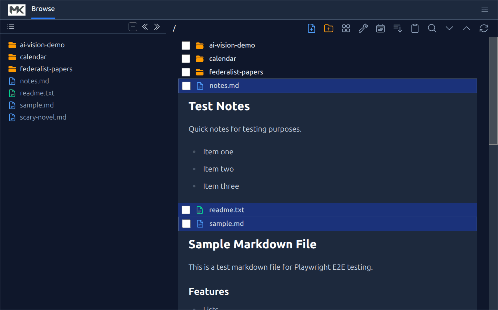
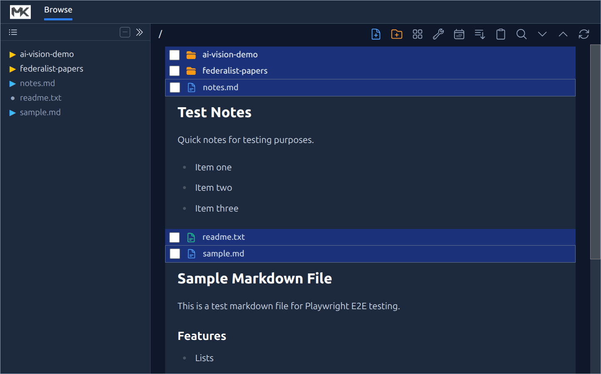
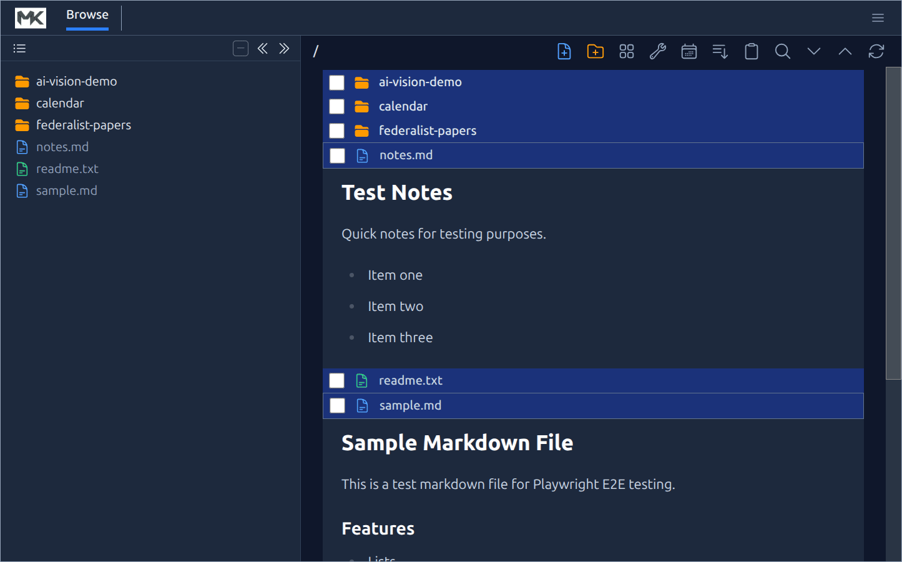
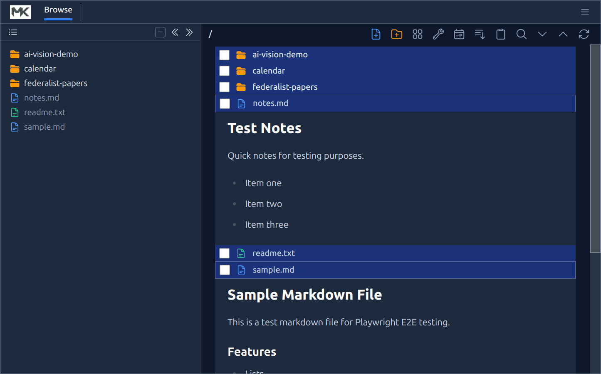
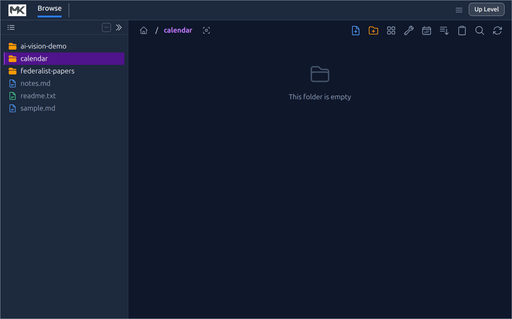

# MkBrowser User Guide

MkBrowser is a file explorer and Markdown editor that helps you manage Markdown notes with inline rendering. This User Guide gives complete instructions, but watching **[All Demo Videos](https://clay-ferguson.github.io/videos/)** first is an easier way to get started.


<!-- TOC -->

# Desktop Icon (Linux)

To add MkBrowser to your application launcher on Ubuntu/GNOME so you can pin it to your dock:

1. Run the install script from the project directory:
   ```bash
   ./install-desktop-icon.sh
   ```
2. This creates a `.desktop` file in `~/.local/share/applications/` that launches MkBrowser using the `mk-browser` command.
3. Open your application launcher (Activities / Show Applications) and find **MkBrowser**.
4. Right-click the icon and choose **Add to Favorites** to pin it to your dock.


# Tab Bar

MkBrowser uses a tab bar at the top of the window to switch between views: **Browse**, **Chat**, **Search**, **Analysis**, **Graph**, **Settings**, **AI Settings**, and **Calendar**. The Browse tab is always present. The others appear only when they are active (e.g. Search appears after you run a search; Chat appears when you navigate into an AI conversation folder).

Each tab that was opened has an **×** button next to its label. Clicking it closes the tab and returns you to the Browse view. Closing a tab also discards its associated state (e.g. closing Search clears the results; closing Analysis clears the analysis data).

# Browsing and Editing

**🎬 [Demo Video (with Audio): File Explorer](https://clay-ferguson.github.io/videos/file-explorer/)**


MkBrowser displays your files and folders in a single streamlined list.

## Viewing Content
- **Markdown Files**: Click on any `.md` file to expand it and view its rendered content directly in the list. You don't need to open a separate preview pane.
- **Images**: Click on image files to preview them inline.
- **Folders**: Click on a folder to navigate into it.

## Expand All / Collapse All

When you have several files open (expanded) at once, **Expand All** and **Collapse All** icon buttons appear in the Browse toolbar. Click **Expand All** to open every file in the current folder simultaneously, or **Collapse All** to close them all in one click.

## Clickable Hashtags

Any hashtag rendered inside a Markdown file (e.g. `#project`, `#urgent`) is a live link. Clicking one runs a literal content search for that tag and switches to the Search Results tab, so you can instantly see every file in the folder that shares the same tag.

## Running Shell Scripts

Any file with a `.sh` extension appears in the file tree and can be launched directly from within MkBrowser.

- **Ctrl+Click** on any `.sh` file name to execute it as a shell script. The script runs immediately and opens in its own terminal window at the operating system level, so you can see its output and interact with it.

### Suppressing the Terminal Window

If you want the script to run silently in the background without a visible console window, add the following directive somewhere near the top of the script file (typically after the shebang line):

```bash
# Terminal=false
```

When MkBrowser detects this directive, it executes the script without opening a terminal window.

## Editing Files

**🎬 [Demo Video (with Audio): Create File](https://clay-ferguson.github.io/videos/create-file/)**


When a Markdown file is expanded, you can edit its content:
1. Click the **Edit** button (pencil icon) in the top-right corner of the file card.
2. The view switches to a code editor where you can make changes.
3. Press `Save` button or use `Ctrl+S` / `Cmd+S` to save your changes.
4. Click the **Close** button (X icon) to return to the rendered view.

### Inserting Links to Other Files

While editing a Markdown file you can quickly insert a link to any other file in the Index Tree without typing the path by hand:

1. Start editing a Markdown file (the code editor must be open).
2. Position the cursor where you want the link to appear.
3. In the **Index Tree** panel on the left, right-click the file you want to link to.
4. Choose **Paste Link** from the context menu.

MkBrowser inserts a relative Markdown link at the cursor position, for example:

```
[notes](../reference/notes.md)
```

If the target file is a Markdown file that contains a front matter `id` property, the id is embedded as an HTML comment immediately after the link:

```
[notes](../reference/notes.md)<!-- id:abc123 -->
```

This lets other tools (and future MkBrowser features) resolve the link by id even if the file is later renamed or moved.

> **Note:** The **Paste Link** item only appears in the context menu when a Markdown file is currently open for editing.

> **Tip:** To link to files (or images) from anywhere in the browser — including other folders — select them with their checkboxes and use **Copy Link**, then **Paste Link** in the editor. See [Copy Link](#copy-link) for the full workflow.

### Editor Keyboard Shortcuts

While the code editor has focus, the following keyboard shortcuts are available:

| Shortcut | Action |
|----------|--------|
| `Esc` | Exit editing — only works if you have **not** made any changes to the file. |
| `Ctrl+Q` | Abandon editing — discards all unsaved changes and exits without prompting. |
| `Ctrl+S` | Save and exit — saves your changes to disk and returns to the rendered view. |

## Automatic Table of Contents Generation

MkBrowser can automatically generate and maintain a **Table of Contents** for any Markdown file. All you need to do is place the following HTML comment anywhere in your file:

```
<\!-- TOC -->
```

That's it. Whenever you save the file, MkBrowser will replace that placeholder with a fully generated table of contents, using every heading in the document (up to three levels deep). The result looks like this:

```
<\!-- TOC -->

* [Introduction](#introduction)
* [Getting Started](#getting-started)
  * [Installation](#installation)
  * [Configuration](#configuration)
* [Advanced Usage](#advanced-usage)

<\!-- /TOC -->
```

On your next save, MkBrowser will regenerate the TOC in place, keeping it in sync with any heading changes you made.

**While editing**, the full TOC block is hidden — the editor shows only the original `<\!-- TOC -->` placeholder so it stays out of your way. The complete TOC is restored as soon as you save.

If your file has no `<\!-- TOC -->` comment, nothing happens. If it has headings but none at the configured depth, or no headings at all, the file is saved unchanged.

## Tag Picker

**🎬 [Demo Video (with Audio): Working with Custom Hashtags](https://clay-ferguson.github.io/videos/hashtags-demo/)**



While editing a Markdown file, a **tag picker** appears below the editor. You can use it to quickly add or remove hashtags from the file you are editing without typing them by hand. Tags are added into the `tags` property of the Markdown front matter, creating a front matter section as necessary. This is identical to the way Obsidian stores tags.

- **Checked** tags are already present in the file's front matter and are highlighted in blue.
- **Unchecked** tags are not currently in the content.
- Clicking an unchecked tag **adds** it to the front matter tags list.
- Clicking a checked tag **removes** it from the tags list.
- **Hover** over any tag to see its description.

The checkboxes stay in sync with the editor as you type, so you can freely mix typing and clicking.

### Category behavior

Tags are organised into **categories**. Within a category the picker behaves like a set of radio buttons — selecting one tag automatically deselects any other tag that was previously selected in the same category. This keeps mutually-exclusive choices (e.g. priority: `#p1`, `#p2`, `#p3`) tidy without manual cleanup.

The special category named **`all`** is an exception to this rule. Tags inside an `all` category act as independent checkboxes: any number of them can be selected simultaneously. Use this category for general-purpose tags that are not mutually exclusive.

### Managing your hashtag library (Tags Editor)

You can define the full set of available hashtags — and how they are organised — through the **Settings View** dialog, with the **Edit Hashtags** button.

The dialog is split into two panes:

- **Left pane — Categories**: lists all your tag categories in alphabetical order. Click a category to select it and see its tags on the right.
  - **Add Category**: click the `+ Add Category` button at the bottom of the list to create a new category. The name field opens immediately for you to type the category name. Press `Enter` or click away to confirm; press `Esc` to cancel.
  - **Rename**: hover over a category row and click the pencil icon (✎) that appears, then edit the name inline.
  - **Delete**: hover over a category row and click the ✕ button. A category can only be deleted when it has no tags; remove all tags from it first.

- **Right pane — Tags**: shows all tags belonging to the selected category.
  - Each tag has a **name** field (the `#` prefix is added automatically) and an optional **description** that appears as a tooltip in the picker.
  - **Add Tag**: click `+ Add Tag` at the bottom of the right pane to add a new row.
  - **Delete a tag**: hover over a tag row and click the ✕ button that appears on the right.

Click **Save** to write the changes to disk, or **Cancel** to discard them. Validation prevents saving if any category or tag name is empty, if two categories share the same name, or if a category contains duplicate tag names.

## Renaming
You can rename any file or folder:
- **Button**: Click the **Rename** button (pencil icon on the folder row) next to the item.
- **Double-click**: Double-click the file or folder name text.
- Enter the new name and press `Enter` to confirm, or `Esc` to cancel.

## File Operations (Cut, Copy, Paste, Delete)
You can manage your files using the application menu or keyboard shortcuts.
- **Selection**: 
    - Click the checkbox next to any file or folder to select it.
    - Select multiple items to perform batch operations.
    - Use **Select All** from the **Edit** menu to select all items in the current folder.
- **Delete**: 
    - Select items and click the **Trash** icon or press the `Delete` key.
- **Cut/Paste**:
    - Select items and choose **Cut** from the **Edit** menu to move files.
    - Navigate to the destination folder and choose **Paste**.

## Navigating Folders

### Recent Folders

MkBrowser remembers up to 10 folders you have visited recently. Click the **application logo** (top-left corner) to open the File menu — recently visited folders are listed there. Click any entry to jump back to it immediately. If the folder is inside the current root it navigates there directly; otherwise it reopens MkBrowser with that folder as the new root.

### Up Level

When you have drilled into a subfolder, an **Up Level** button appears in the top-right of the tab bar. Clicking it navigates to the parent folder and highlights the subfolder you just came from, so you can see it in context.

## Drag and Drop

In addition to Cut/Paste, you can move a single file or folder by dragging and dropping it onto a destination folder. The file or folder **icon** is the drag handle: click and hold an icon, then drag it onto a target. When you release, the item is moved into that folder on disk.

Dragging works in both directions between the **folder tree** (the panel on the left) and the **browse view** (the main panel), and you can also drop onto the **breadcrumbs** at the top of the browse view:

- **From the browse view → the tree**: drag a file or folder icon in the main panel and drop it onto any folder in the tree.
- **From the tree → the browse view**: drag a file or folder icon in the tree and drop it onto any folder shown in the main panel.
- **Onto the breadcrumbs**: drop onto any segment of the breadcrumb path (including the home/root icon) to move the item into that folder. This is a quick way to move an item "up" into a parent of the folder you're currently browsing.

As you drag, an outline of the item follows the cursor, and the folder you're hovering over is highlighted to show where the item will land. The destination folder's contents refresh automatically wherever the change is visible.

# Bookmarks

Bookmarks give you quick access to frequently visited files and folders. They are managed from the **Index Tree** panel on the left side of the Browse view.

## Adding a Bookmark

Every file and folder in the browse list has a **bookmark icon** (a flag/ribbon outline) that appears in its action bar. Click it to bookmark that item:

1. A dialog appears asking you to give the bookmark a name. The item's filename is pre-filled as a default.
2. Enter a name and click **Save** (or press `Enter`).

The icon turns solid blue to indicate the item is bookmarked.

## Removing a Bookmark

Click the solid blue bookmark icon on any bookmarked item to remove it immediately — no confirmation required.

## Navigating with Bookmarks

Click the **Bookmarks** button (bookmark icon) at the top of the **Index Tree** panel to open the bookmarks menu. It lists all bookmarks that fall under the current root folder, sorted alphabetically. Click any entry to navigate directly to that file or folder.

If a bookmarked path no longer exists on disk, MkBrowser removes it automatically and shows a notice.

## Renaming and Deleting Bookmarks

Hover over any bookmark in the menu to reveal two icon buttons on the right:

- **Pencil icon** — opens a dialog to rename the bookmark.
- **Trash icon** — deletes the bookmark immediately.

# Edit Menu Features

The **Edit** menu provides a set of tools for managing and manipulating your files and selections. Below are the main features available:

## Undo Cut
Restores items that were previously marked as "cut" (for moving) back to their original state, cancelling the pending move operation. Use this if you change your mind after cutting items but before pasting them.

## Select All
Selects all files and folders in the current directory, making it easy to perform batch operations like cut, copy, or delete.

## Unselect All
Clears all current selections in the file list, so no items remain selected.

## Split
See [Split and Join](#split-and-join) for full details. Splits a single text or Markdown file into multiple files at each double blank line (two consecutive empty lines). The new files are named with numeric suffixes to preserve order.

## Join
See [Split and Join](#split-and-join) for full details. Combines two or more selected text or Markdown files into a single file, inserting double blank lines between each file's content. The result is saved to the alphabetically first file, and the others are deleted after joining.

## Replace in Files
See [Replace in Files](#replace-in-files) for details. Opens a dialog to search and replace text across all `.md` and `.txt` files in the current folder and subfolders.

## Copy Link

**Copy Link** lets you capture one or more files (or folders) in the browser and later paste them as relative Markdown links into any Markdown file you are editing — even one in a completely different folder. Image files are pasted as inline images, so they display directly in the rendered document.

To use it:

1. In the browser, use the checkboxes to select the files and/or folders you want to link to. (These are the same checkboxes used by the Cut and Paste feature.)
2. Open the **Edit** menu and choose **Copy Link**. The selected paths are remembered, and the checkboxes are cleared automatically.
3. Start editing the Markdown file you want the links to appear in, and place the cursor where the links should go.
4. Right-click in the editor and choose **Paste Link** from the context menu.

MkBrowser inserts a Markdown link for each captured item, computing the correct path **relative to the file you are editing**. Each link appears on its own line, separated by a blank line. For example, after copying an image and a document and pasting them into a file in a sibling folder:

```


[notes.md](../reference/notes.md)
```

When rendered, the image is displayed inline and the document appears as a normal clickable link. File names that contain spaces or other special characters are handled automatically.

> **Note:** **Copy Link** simply remembers the selected items; it does not move or modify any files. The captured items stay remembered until you run **Copy Link** again, so you can paste the same set of links into multiple files. The **Paste Link** context-menu item only appears while editing a Markdown file.


## Cut and Paste

The **Cut** operation allows you to move files and folders to a new location. To use it:

1. Select one or more items in the Browse view by clicking the checkboxes next to each file or folder.
2. When items are selected, a **Cut** button appears at the top of the page. Click it to mark the selected items for moving.
3. Once items have been cut, various **Paste** icons will appear throughout the application—anywhere a folder is a valid paste destination.
4. Click a **Paste** icon next to your desired destination folder to move the cut items there.

**Notes:**
- You can only paste into folders where the operation is valid (e.g., not into the same folder the items came from, and not if it would create duplicates).
- After pasting, the items are moved to the new location and removed from their original folder.
- If you change your mind after cutting but before pasting, use **Undo Cut** from the Edit menu to cancel the operation.

## Delete

The **Delete** operation lets you remove files and folders from your workspace. There are two ways to delete:

1. **Single item:** Click the **Delete** (trash) icon next to any file or folder to delete just that item.
2. **Multiple items:** Select multiple items using the checkboxes, then click the **Delete** button that appears at the top of the page when items are selected. All selected items will be deleted in one action.

**Notes:**
Deleted files go into your operating system trash bin rather than being permanently deleted.

## Split and Join

MkBrowser provides **Split** and **Join** operations to help you break apart large files or combine multiple files into one. These features work with text (`.txt`) and Markdown (`.md`) files.

### Split

The **Split** feature divides a single file into multiple smaller files using a double blank line as the delimiter.

**How to use Split:**

1. Click the checkbox next to the text or Markdown file you want to split (select exactly one file).
2. Go to **Edit → Split** in the menu bar.
3. The file will be divided at each occurrence of a **double blank line** (two consecutive empty lines).

**What happens:**

- The original file is renamed with a `-00` suffix (e.g., `my-notes.md` becomes `my-notes-00.md`).
- Each subsequent section becomes a new file with incrementing numbers: `my-notes-01.md`, `my-notes-02.md`, etc.
- The numbered suffixes ensure files sort alphabetically in the correct order.

**Example:**

If you have a file `chapter.md` with this content:

```
# Part One

This is the first section.


# Part Two

This is the second section.


# Part Three

This is the third section.
```

After splitting, you'll have three files:
- `chapter-00.md` containing "# Part One..."
- `chapter-01.md` containing "# Part Two..."
- `chapter-02.md` containing "# Part Three..."

**Requirements:**
- Exactly one file must be selected.
- The file must be a `.txt` or `.md` file.
- The file must contain at least one double blank line (the delimiter).

### Join

The **Join** feature combines multiple files into a single file, inserting a double blank line between each file's content.

**How to use Join:**

1. Click the checkboxes next to two or more text or Markdown files you want to combine.
2. Go to **Edit → Join** in the menu bar.
3. The files will be merged into a single file.

**What happens:**

- Files are sorted alphabetically by filename before joining.
- The content of all files is concatenated with a **double blank line** (`\n\n\n`) separator between each file's content.
- The combined content is written to the alphabetically first file.
- The other files are deleted (only after verifying the write succeeded).

**Example:**

If you select these three files:
- `notes-00.md` (content: "First part")
- `notes-01.md` (content: "Second part")
- `notes-02.md` (content: "Third part")

After joining, only `notes-00.md` remains, containing:

```
First part


Second part


Third part
```

**Requirements:**
- At least two files must be selected.
- All selected items must be files (not folders).
- All files must be `.txt` or `.md` files.

**Safety:** The Join operation verifies that the combined content was written correctly by checking the file size before deleting the other files. This ensures no data is lost.

# File Attachments

MkBrowser lets you associate files — images, PDFs, spreadsheets, or any other files — directly with a Markdown document. These associated files are called **attachments**, and they live in a special folder that MkBrowser automatically recognizes.

## How Attachments Work

For any Markdown file named, for example, `my-notes.md`, you can create a companion folder named `my-notes.md.attach` in the same directory. MkBrowser will treat everything inside that folder as an attachment belonging to `my-notes.md`. In **Document Mode**, attachments are displayed inline, directly below their associated file, so it is easy to see what belongs together.

## Adding Attachments

The easiest way to attach files to a document is using the **Cut and Paste** workflow:

1. Select the files you want to attach by clicking their checkboxes.
2. Click the **Cut** button that appears at the top of the page to mark them for moving.
3. Navigate to the folder that contains the Markdown file you want to attach them to.
4. Click the **paperclip** icon that appears next to the Markdown file.

MkBrowser will automatically create the `.attach` folder if it does not already exist, then move the cut files into it. Once the `.attach` folder exists, a **Paste** icon appears directly on it, so you can paste additional files into it at any time using the normal paste workflow.

## Renaming

If you rename a Markdown file using the rename button, MkBrowser automatically renames its `.attach` folder to match, so the association is never broken.

## Viewing Attachments

In **Document Mode**, the contents of any `.attach` folder are shown inline below their associated file, indented to indicate they belong to it. The folder name itself is hidden when you are not in edit mode, keeping the view clean. In a normal (non-Document Mode) folder, the `.attach` folder appears as a regular folder in the file list.

# Document Mode

**🎬 [Demo Video (with Audio): Document Mode](https://clay-ferguson.github.io/videos/document-mode/)**


Document Mode lets you treat any specific folder as a structured document, where each file (or subfolder) in that folder represents a block of content, in the context of a larger document, represented by the whole folder. Instead of files/folders appearing in some arbitrary filesystem order, `Document Mode` gives you full control over the sequence — so you can arrange your content exactly as it should read as a "Document". This block-based approach to editing will be familiar to people who have used Jupyter Notebooks because it's a similar concept.

This is useful any time a folder represents something with a meaningful order: a book where each chapter is a file, a course where each lesson is a subfolder, a report broken into sections, or any collection where sequence matters.

## Enabling Document Mode

1. Navigate into the folder you want to treat as a document.
2. Open the **Sort** menu (the sort button in the toolbar).
3. Click **Enable Docment Mode** at the bottom of the menu.

MkBrowser will immediately switch the folder into Document Mode. A hidden file named `.INDEX.yaml` is created in that folder — this file records and maintains the display order of all the entries. You don't need to edit this file directly; MkBrowser manages it for you automatically. Once Document Mode is enabled you will no longer see the "Sort" menu because files are treated like paragraphs in a document and are in a fixed order defined by you. If you want to to back to making the folder behave like a normal folder (not a Document) then you must manually delete the `.INDEX.yaml` file from your file system, which you can safely do, and the only thing you will lose is the ordering of the files, which you no longer want.

## Editing Mode

By default, Document Mode displays your content in a read-only view. To reveal the controls for rearranging and creating content, enable editing:

- Check the **Edit** checkbox in the folder's toolbar.

With editing enabled, the following controls appear on each entry:

- **Move Up** (arrow up icon): Moves the file or folder one position earlier in the document order.
- **Move Down** (arrow down icon): Moves the file or folder one position later.
- **Ctrl + Move Up**: Moves the entry all the way to the top of the list in one click.
- **Ctrl + Move Down**: Moves the entry all the way to the bottom of the list in one click.

## Inserting New Files and Folders

When editing is enabled, **insert bars** appear between every pair of entries (and at the very top of the list). Each insert bar has two icon buttons:

- **Create File here** — opens the new-file dialog and inserts the file at that exact position.
- **Create Folder here** — opens the new-folder dialog and inserts the folder at that position.

This lets you add new content at any point in the document without having to move things around afterwards.

## Disabling Document Mode

If you want to go back to treating the folder as ordinary files — with normal sort options — you can disable Document Mode by deleting the `.INDEX.yaml` file from the folder.

You can do this from within MkBrowser (enable editing, then delete the file using the trash icon) or from your operating system's file manager or terminal. Once `.INDEX.yaml` is gone, the folder returns to standard sort behavior.

# Searching

**🎬 [Demo Video (with Audio): Search](https://clay-ferguson.github.io/videos/search/)**


MkBrowser includes a powerful search feature to help you find content across your notes.

## Using Search
1. Click the **Search** button in the toolbar or press `Ctrl+Shift+F`.
2. Enter your search query.
3. Choose your search options:
    - **Search Target**: Choose to search **File Content** or **File Names**.
    - **Search Mode**: 
        - **Literal**: Exact text match.
        - **Wildcard**: Use `*` to match any characters (e.g., `note-*.md`).
        - **Advanced**: Use custom predicate functions (see below).

## Advanced Search Predicates

**🎬 [Demo Video (with Audio): Advanced Search](https://clay-ferguson.github.io/videos/advanced-search/)**


In **Advanced Mode**, you can write JavaScript-like expressions to filter files. The following custom functions and variables are available:

*   **`$('text')`**: Returns `true` if the file content contains the text "text" (case-insensitive).
    *   Example: `$('important')` finds files containing "important".
*   **`ts`**: A pre-existing variable containing the first date/timestamp found in the file (format: MM/DD/YYYY). Returns a number representing the date in milliseconds, or 0 if no timestamp is found.
*   **`past(date, lookbackDays?)`**: Returns `true` if the date is in the past. The optional `lookbackDays` parameter limits results to timestamps within the specified number of days ago (e.g., `past(ts, 7)` matches timestamps from the last 7 days).
*   **`future(date, lookaheadDays?)`**: Returns `true` if the date is in the future. The optional `lookaheadDays` parameter limits results to timestamps within the specified number of days ahead (e.g., `future(ts, 30)` matches timestamps within the next 30 days).
*   **`today(date)`**: Returns `true` if the date is today.
*   **`prop(propertyPath, valType?)`**: Returns the value of the property at `propertyPath` from the file's YAML front matter, or `undefined` if not found. Use dot-notation to reach nested properties (e.g. `'author.name'`). The optional `valType` argument controls the return type: `"string"` (default) returns the raw value; `"ts"` interprets the property value as a date/datetime string (MM/DD/YYYY with optional HH:MM[:SS] AM/PM) and returns a numeric timestamp in milliseconds, suitable for use with `past()`, `future()`, and `today()`.

**Examples:**
*   Find files with "TODO" that are due in the future:
    ```javascript
    $('#TODO') && future(prop('due_date', 'ts'))
    ```
*   Find files with "Meeting" that happened in the past:
    ```javascript
    $('#meeting') && past(prop('due_date', 'ts'))
    ```
*   Find files with "TODO" due within the next 7 days:
    ```javascript
    $('#TODO') && future(prop('due_date', 'ts'), 7)
    ```
*   Find files with "Review" from the last 30 days:
    ```javascript
    $('#review') && past(prop('due_date', 'ts'), 30)
    ```
*   Find files containing both "project" and "urgent":
    ```javascript
    $('#project') && $('#urgent')
    ```
*   Find files whose front matter `category` property is `sports`:
    ```javascript
    prop('category') == 'sports'
    ```
    Matches files with front matter like:
    ```markdown
    ---
    category: sports
    ---
    ```
*   Find files with a nested front matter property, e.g. `author.role` set to `editor`:
    ```javascript
    prop('author.role') == 'editor'
    ```
    Matches files with front matter like:
    ```markdown
    ---
    author:
      name: Jane
      role: editor
    ---
    ```
*   Find files with a front matter `dueDate` property that is in the future:
    ```javascript
    future(prop('dueDate', 'ts'))
    ```
    Matches files with front matter like:
    ```markdown
    ---
    due_date: 06/15/2026
    ---
    ```
*   Find files whose `tags` list contains `p1`:
    ```javascript
    prop('tags')?.includes('p1')
    ```
    Matches files with front matter like:
    ```markdown
    ---
    tags:
      - bill
      - p1
      - to-buy
    ---
    ```
*   Combine a tag list check with a content search — files tagged `urgent` that also mention "deadline":
    ```javascript
    prop('tags')?.includes('urgent') && $('#deadline')
    ```

## Search Highlight

After a search, MkBrowser highlights every occurrence of the search term across all rendered Markdown content in the Browse view — not just in the Search Results tab. This makes it easy to spot matching text as you scroll through your files.

To remove the highlight, open the **Search** menu and click **Clear Search Highlight**. The option only appears when a highlight is active.

## Saving Search Definitions
You can save frequently used searches for quick access later.

1. In the Search dialog, enter your search query and configure the options.
2. Type a name for your search in the **Search Name** field.
3. Click **Search** to execute and save the definition.

Once saved, your search definitions appear in the **Search** menu on the application's main menu bar (sorted alphabetically). Simply click a saved search to execute it immediately.

**Tip:** Hold **Ctrl** while clicking a search menu item to open the Search dialog with that definition pre-filled. This allows you to review the search parameters before running it, or to edit and update the saved definition.

# Replace in Files

MkBrowser includes a **Replace in Files** feature that allows you to find and replace text across all Markdown (`.md`) and text (`.txt`) files in the current folder and all subfolders.

## Using Replace in Files

1. Navigate to the folder where you want to perform the replacement.
2. Go to **Edit → Replace in Files** in the menu bar.
3. In the dialog that appears:
   - **Search for**: Enter the exact text you want to find.
   - **Replace with**: Enter the replacement text (can be empty to delete matches).
4. Click **Replace** to perform the replacement, or **Cancel** to close the dialog.

## What Happens

- The replacement searches recursively through all subfolders.
- Only `.md` and `.txt` files are processed.
- All occurrences of the search text are replaced (not just the first occurrence in each file).
- The search is **case-sensitive** and matches **exact text** only.
- Files configured in your **Ignored Paths** setting (see Settings) are skipped.

## Results Summary

After the replacement completes, a dialog will show you:
- The total number of replacements made.
- The number of files that were modified.
- If any files could not be processed, you'll see a count of failed files.

**Example:**
> "Replaced 15 occurrences in 4 files."

## Tips

- **Preview first**: Use the Search feature to find matches before replacing, so you know what will be changed.
- **Backup**: For large-scale replacements, consider backing up your folder first.
- **Special characters**: The search treats your text literally—special characters like `*`, `.`, or `?` are matched exactly as typed, not as wildcards or patterns.

# Folder Analysis

MkBrowser can analyze the contents of the current folder to provide useful statistics about your notes. Currently, the analysis extracts and counts all **hashtags** found across your Markdown and text files.

## Running an Analysis

1. Navigate to the folder you want to analyze.
2. Go to **Tools → Folder Analysis** in the menu bar.
3. The analysis will immediately scan all `.md` and `.txt` files recursively (including subfolders), then display the results in the **Analysis** view.

## What Gets Scanned

- All `.md` and `.txt` files in the current folder and all subfolders are included.
- Files and folders matching your **Ignored Paths** setting (see Settings) are skipped.
- The scan extracts hashtags — words starting with `#` followed by letters, numbers, underscores, or hyphens (e.g., `#project`, `#in-progress`, `#v2`).

## Analysis Results

The Analysis view shows:

- **Total files scanned**: The number of `.md` and `.txt` files that were processed.
- **Hashtag list**: Every unique hashtag found, sorted by frequency (most common first). Each entry shows the hashtag name and its total number of occurrences across all scanned files.

## The Analysis Tab

After running an analysis, an **Analysis** tab appears in the tab bar at the top of the application (alongside Browse, Search, and Settings). You can switch between tabs freely — the analysis results are preserved until you run a new analysis or close the application.

**Note:** The Analysis tab only appears after you've run at least one analysis. It is not shown on a fresh application start.

## Clicking a Hashtag

In the Analysis results list, every hashtag is a clickable button:

- **Click** a hashtag to run a literal content search for that tag and switch to the Search Results tab.
- **Ctrl+Click** a hashtag to run an advanced-mode search (`$("hashtag")`) instead, which uses the full expression evaluator and can be combined with other predicates.

# Folder Graph

The Folder Graph gives you an interactive, visual map of the folder you're currently browsing. Subfolders and files are drawn as nodes connected by lines that represent the parent → child relationship, laid out using a physics simulation so related items naturally cluster together.

## Launching the Graph

1. Navigate to the folder you want to visualize.
2. Go to **Tools → Folder Graph** in the menu bar.
3. The application scans the folder recursively and opens a new **Folder Graph** tab showing the result.

The graph reflects a snapshot of the folder at scan time. To refresh it (or to view a different folder), navigate to the folder you want and run **Tools → Folder Graph** again — the existing graph is replaced.

## Reading the Graph

- **Folders** are colored circles. Larger circles indicate folders with more direct children, and the color shifts with depth (cyan at the top, transitioning through blue and violet to warmer tones the deeper you go).
- **Files** are smaller slate-gray circles.
- **Labels** show the name of each item (long names are truncated). Hover over any node to see its full path as a tooltip.

## Interacting with the Graph

- **Pan**: Click and drag any empty area of the background to move the view.
- **Zoom**: Scroll the mouse wheel to zoom in and out.
- **Drag a node**: Click and drag any node to reposition it. The rest of the graph reacts physically — connected nodes follow, and the layout settles around your new position. Releasing the node lets it rejoin the simulation.
- **Click a node** (without dragging):
  - Clicking a **folder** switches to the Browse view and navigates into that folder.
  - Clicking a **file** switches to the Browse view of its parent folder and scrolls the file into view.

The graph initially auto-fits itself into the viewport once the layout settles, so you start with the entire structure in view.

## Tab Persistence

After you generate a graph, the **Folder Graph** tab stays available in the tab bar. You can switch between Browse, Search, and other tabs freely — when you return to the Folder Graph tab, your zoom level, pan position, and any nodes you dragged are exactly as you left them. The tab persists for the rest of the session, until you re-run **Tools → Folder Graph** (which replaces the current graph) or close the application.

## Scan Limits

To keep the graph readable and responsive, the scan is bounded:

- It descends at most a fixed number of levels below the starting folder.
- It stops once a maximum number of nodes have been collected, preferring items closer to the root.
- Hidden files and any paths matching your **Ignored Paths** setting are excluded, just as in Folder Analysis.

If the limit was hit, an amber **"truncated — node cap reached"** indicator appears in the header of the graph view, letting you know that some deeper or later items were omitted. To see a smaller area in full detail, navigate into a subfolder and run the graph from there.

## Search-based Graph

The same Folder Graph view can also be populated from the results of a search, giving you a visual map of *just the files that matched* and the folders that contain them — rather than every file under a folder.

To use it:

1. Run a search from the Browse tab so that the **Search** tab is populated with results.
2. On the Search tab, click the **Graph View** button at the top right of the header.
3. The Folder Graph tab opens and renders a tree containing only the matched files plus the ancestor folders needed to connect them up to a common root.

The graph behaves identically to a folder-scanned graph — pan, zoom, drag, and click-to-navigate all work the same way. The button is disabled when there are no search results to graph.

This is useful for understanding how your search hits are distributed across the directory structure: tightly clustered hits indicate a focused area, while widely scattered hits show the spread of a topic across your tree. Re-running a search and clicking **Graph View** again replaces the previous graph.

# Exporting

**🎬 [Demo Video (with Audio): Generate PDF](https://clay-ferguson.github.io/videos/generate-pdf/)**


You can export the contents of the current folder into a single document.

1. Click the **Export** button in the toolbar.
2. Configure the export settings:
    - **Output Folder**: Choose where to save the exported file.
    - **File Name**: Name the output file.
    - **Include Subfolders**: Check this to include content from all subfolders recursively.
    - **Include File Names**: Adds the filename as a header before each file's content.
    - **Include Dividers**: Adds a visual separator between files.
    - **Export to PDF**: If checked, the application will attempt to generate a PDF file instead of a Markdown file.
3. Click **Export** to finish.

# OCR

MkBrowser can run Optical Character Recognition (OCR) on images in the current folder via **Tools → Run OCR**. This menu item only appears when the **OCR Tools Folder** path has been configured in Settings.

To set it up:

1. Open **Settings** and locate the **OCR** section.
2. Enter the absolute path to your OCR tools folder in the **OCR Tools Folder** field.
3. Once configured, navigate to a folder containing images and choose **Tools → Run OCR**.

MkBrowser passes the images to the external OCR tool and writes the resulting text files into the current folder.

# Markdown Support

**🎬 [Demo Video (with Audio): Create Mermaid Diagram](https://clay-ferguson.github.io/videos/create-mermaid/)**


MkBrowser renders Markdown using **GitHub Flavored Markdown (GFM)**, which includes tables, strikethrough, task lists, and autolinks. On top of standard GFM, the following extended features are supported:

- **LaTeX math** — inline (`$...$`) and block (`$$...$$`) equations via KaTeX (see [LaTeX Math Support](#latex-math-support) below).
- **Wikilinks** — `[[filename]]` and `[[filename|alias]]` syntax for linking between files (see [Wikilinks](#wikilinks) below).
- **Syntax highlighting** — fenced code blocks with a language tag (e.g., ` ```python `) are rendered with syntax colors.
- **Mermaid diagrams** — fenced code blocks tagged ` ```mermaid ` are rendered as diagrams.
- **Escaped dollar signs** — use `\$` to display a literal `$` without triggering math mode.

## Column Layout (`|||`)

Placing `|||` on a line by itself within a Markdown file designates a column break. MkBrowser will split the document at each such delimiter and render the resulting sections side-by-side in an equal-width multi-column layout. Other Markdown renderers that are unaware of this convention will display `|||` as plain text.

# Wikilinks

MkBrowser supports wikilink syntax, a popular convention (used by Obsidian, Notion, and other tools) for linking between files using double square brackets. Wikilinks are automatically converted into standard Markdown links when rendered.

## Syntax

- **Basic link**: `[[filename]]` — creates a link to the file, displayed as the filename.
- **Link with alias**: `[[filename|My Description]]` — creates a link to the file, displayed as "My Description".
- **Link to section**: `[[filename#section]]` — creates a link to a specific section heading within the file.
- **Section link with alias**: `[[filename#section|description]]` — creates a link to a section, displayed as "description".

## Examples

| You write | Rendered as |
|-----------|-------------|
| `[[readme]]` | A clickable link labeled "readme" pointing to `readme` |
| `[[notes.md\|My Notes]]` | A clickable link labeled "My Notes" pointing to `notes.md` |
| `[[guide#installation]]` | A clickable link labeled "guide#installation" pointing to the "installation" section of `guide` |
| `[[guide#installation\|Setup]]` | A clickable link labeled "Setup" pointing to the "installation" section of `guide` |

Clicking a wikilink navigates to the linked file, just like clicking any other Markdown link in MkBrowser.

# LaTeX Math Support

**🎬 [Demo Video (with Audio): Create LaTeX](https://clay-ferguson.github.io/videos/create-latex/)**


MkBrowser supports rendering mathematical equations using LaTeX syntax via KaTeX, compatible with GitHub's math rendering.

## Syntax

- **Inline Math**: Wrap your equation in single dollar signs: `$equation$`
  - Example: `$f(x)$` renders as an inline formula
  
- **Block Math**: Use double dollar signs on separate lines for display equations:
  ````
  $$
  equation
  $$
  ````

## Escaping Dollar Signs for Currency

Since `$` is used for math delimiters, use the standard LaTeX escape `\$` to display literal dollar signs (e.g., for monetary values):

| You type | Renders as |
|----------|------------|
| `\$100` | $100 |
| `\$49.99` | $49.99 |
| `$x^2$` | *x²* (math) |

This is the same escape convention used in traditional LaTeX and is compatible with most Markdown-with-math systems.

## Example

Here's how to write the calculus limit definition:

````markdown

# Calculus Limit Definition

For a function $f(x)$, the derivative at a point $x$ is defined as:

$$
f'(x) = \lim_{h \to 0} \frac{f(x + h) - f(x)}{h}
$$

This course costs \$99.
````

**Rendered output:**

For a function $f(x)$, the derivative at a point $x$ is defined as:

$$
f'(x) = \lim_{h \to 0} \frac{f(x + h) - f(x)}{h}
$$

This course costs $99.

# AI Chat

**🎬 [Demo Video (with Audio): AI Chat](https://clay-ferguson.github.io/videos/ai-chat/)**



MkBrowser includes an integrated AI chat feature that organizes each conversation into a folder-based history. Each turn in the conversation is saved in its own folder as the chat progresses: your prompt is written to `HUMAN.md`, and MkBrowser saves the AI's reply to `AI.md`. When using a reasoning model (such as Gemma 4), MkBrowser also saves the model's internal chain-of-thought to `THINK.md` alongside the reply, so you can see exactly how the model arrived at its answer. 

As the chat conversation progresses each back and forth turn will result in a new subfolder being created underneath the previous turn, such that you'll end up with a folder structure that looks like `A/H/A/H` (A=AI, H=Human). We use the very short folder names, so that the path can be very long and the conversation can be very long without the folder length limitation being an issue.

## Chat Thread View

When you navigate into an AI conversation folder (one that contains `HUMAN.md` or `AI.md` files), a **Chat** tab automatically appears in the tab bar. Clicking it switches to the Thread view, which renders the full conversation as a vertically stacked list of turns — oldest at the top, newest at the bottom — so you can read the entire exchange without jumping between files.

The Thread view header shows the name of the active AI persona being used for the conversation.

### AI Conversation Hint Text

In the Browse view, AI conversation folders display a short italic preview of the AI's last response next to the folder name. This gives you a quick at-a-glance summary of what each branch of the conversation contains, without having to open it.

### Replying in a Thread

While viewing a conversation in the Chat tab, a **Reply** button appears at the bottom of the thread. Clicking it:

1. Creates a new `HUMAN.md` file in the correct subfolder for the next turn.
2. Opens that file immediately in the editor, ready for you to type your next message.
3. After you save and the AI responds, the thread reloads to show the new exchange.

You can also navigate into child branch folders (sibling responses, rephrased prompts) directly from the Thread view and the tab stays on Chat — the breadcrumb updates to show your position in the conversation tree.

## Benefits of Folder-based Chat History

### 1. Complete Transparency
Conversations are plain files and folders. No database, no proprietary format. Inspect any conversation with `ls` and `cat`. Nothing is hidden.

### 2. Full Portability
Archive a conversation with `tar` or `zip`. Copy it to another machine. Email it. Put it on a USB drive. No export step needed — the filesystem IS the format.

### 3. Git-Native Version Control
Every conversation is diffable, branchable, and recoverable with standard Git. You get full history for free. Teams can collaborate on conversations via pull requests.

### 4. Rich Artifact Responses
The AI's response isn't trapped in a text box. It can be an entire project structure — source code, tests, documentation, configuration files. Ask "build me a React component with tests" and get a folder you can immediately run.

### 5. Natural Multi-Agent Support
Branching (sibling `A`, `A1`, `A2` folders) makes multi-agent workflows native rather than bolted-on. Send the same prompt to Claude and GPT-4, get separate response folders, compare them side-by-side.

### 6. Consensus Systems
A third AI agent can be given two sibling response folders and asked to evaluate, compare, or synthesize them. The multi-agent branching structure makes this architecturally natural.

### 7. Branching Visibility at a Glance
Listing a directory immediately reveals whether a conversation branched. Seeing `A` and `A1` means two agent replies exist. Seeing `H` and `H1` means the human rephrased. No metadata needed to detect this.

### 8. Conversation Search Across Threads
MkBrowser's existing search infrastructure (literal, wildcard, advanced modes) works immediately across all conversations. "Find every time Claude suggested using a factory pattern" is just a content search over `AI.md` files.

### 9. Conversation Forking
"I liked where this was going at turn 5 but turn 7 went off the rails" — copy turns 1–5 into a new conversation root and continue. Filesystem copy makes this trivial.

### 10. Human-Readable Without MkBrowser
Even without the application, conversations are fully navigable and readable in any file manager or terminal. The design degrades gracefully to the simplest possible tools.

### 11. Minimal Path Depth (H/A Convention)
Single-character folder names maximize the number of turns before hitting filesystem path limits. Linear conversations use bare `H`/`A` (zero overhead). Numbering only appears when branching actually occurs, costing characters only when disambiguation is genuinely needed.

### 12. Implicit Ordering
The parent-child relationship encodes turn order. Walking `..` from any folder reconstructs the exact conversation lineage without ambiguity — no manifest file needed for linear threads.

### 13. Self-Organizing via System Prompt
The AI maintains the conversation structure itself via tools, guided by the system prompt. This minimizes custom code and lets the protocol evolve by editing a prompt rather than rewriting application logic.

### 14. Attachment-Native
Multimodal prompts are natural — drop images, PDFs, or any files alongside `HUMAN.md` or `AI.md` and they're included in the prompt. No special upload UI needed.

### 15. Replay and Export
A flattener can walk the folder tree and produce a single Markdown document (for sharing), or convert to OpenAI/Anthropic conversation format (for fine-tuning or migration).

## AI Settings

All AI-related configuration lives in **Settings → AI Settings**.

### Enable AI Features

Turn on **Enable AI Features** to show AI chat features in the UI.

If this is off:

- AI chat features are hidden/disabled.
- Agentic Mode, model selection, and usage statistics are not shown.

### AI Model

Use the **AI Model** dropdown to pick which model MkBrowser will use for chat.

MkBrowser stores a list of named model entries; each entry has:

- **Name**: A friendly label shown in the dropdown (e.g. “Claude Haiku”).
- **Provider**: One of `ANTHROPIC`, `OPENAI`, `GOOGLE`, or `LLAMACPP`.
- **Model**: The provider's model identifier string (e.g. `claude-3-haiku-20240307`, `gpt-4.1-nano`, `gemini-2.0-flash-lite`, or a llama.cpp model name).

#### Create / Edit / Delete models

Next to the model dropdown are three small icon buttons:

- **Create** (plus icon): Create a new model entry.
- **Edit** (pencil icon): Edit the currently selected model entry.
- **Delete** (trash icon): Delete the currently selected model entry.

When you create or edit a model, you’ll be asked for:

- **Name**
- **Provider**
- **Model**

If you try to create a new entry with the same **Name** as an existing entry, MkBrowser will prompt you to confirm overwriting the existing one.

The model table also shows two columns that are useful for cost planning:

- **Vision** — a checkmark (✓) indicates the model supports image inputs (multimodal prompts).
- **Input $/1M / Output $/1M** — the estimated cost per million input and output tokens, respectively. These are used to compute the figures shown in AI Usage Statistics.

### llama.cpp Base URL

The **llama.cpp Base URL** field is only shown when the selected model's **Provider** is `LLAMACPP`.

- Default: `http://localhost:8080/v1`
- Change this if your llama-server is running on a different host or port.

This setting is saved when the field loses focus (click away / tab out).

### llama.cpp Server Controls

When the selected model's **Provider** is `LLAMACPP`, an additional server control panel appears in AI Settings with the following buttons:

- **Start** — launches the llama-server process using the configured **Llama.cpp folder** path.
- **Stop** — shuts down the running server.
- **Refresh** — checks the current server status without restarting it.

The status indicator shows **Running**, **Loading model…**, or **Stopped**. The **Start** and **Stop** buttons are disabled when they would have no effect (e.g. Start is disabled while the server is already running or loading).

You must also set the **Llama.cpp folder** field to the directory that contains the `llama-server` executable. This is separate from the Base URL — the folder is used to *launch* the server, while the URL is used to *talk* to it.

### AI Settings View


### Supported Models


### Agentic Mode

When **Agentic Mode** is enabled, MkBrowser allows the AI to call built-in tools that interact with your file system while it is generating a response.

In this project, the agent tools include:

- Reading and listing files/folders
- Writing/creating files
- Deleting files and folders

When Agentic Mode is disabled, the AI runs in a simpler “non-agentic” mode (no tool-calling) and can only respond based on the prompt content and any attachments you included.

### Allowed Folders

**Allowed Folders** is only shown when Agentic Mode is enabled.

Enter **one absolute path per line**. The AI’s file tools are restricted to paths under these folders.

Notes:

- If the list is empty, file tools will be denied.
- Use this to scope access tightly (for example, only your notes folder or a dedicated project folder).

### API keys for cloud providers

For cloud providers (`ANTHROPIC`, `OPENAI`, `GOOGLE`), authentication is done via environment variables at app launch.

Common environment variables:

- `ANTHROPIC_API_KEY`
- `OPENAI_API_KEY`
- `GOOGLE_API_KEY`

MkBrowser does not currently provide UI fields for entering API keys.

### AI Usage Statistics

After you make at least one AI request, an **AI Usage Statistics** section appears in Settings.

It shows:

- **Total Requests**
- **Total Tokens** (input + output)
- **Estimated Total Cost**
- A per-provider breakdown of requests, tokens, and estimated cost

Use **Reset** to clear the saved usage stats. This cannot be undone.


## Attaching files with `#file:`

**🎬 [Demo Video (with Audio): AI Vision](https://clay-ferguson.github.io/videos/ai-vision/)**


MkBrowser supports a lightweight “attachment directive” you can put directly into your prompt.

If a line in `HUMAN.md` matches this format:

```markdown
#file:<pattern>
```

MkBrowser will try to match files in the **current conversation folder** (the same folder that contains the `HUMAN.md` you’re editing), read the matched files, and embed their contents into the prompt that is sent to the model.

### Patterns and wildcards

- Patterns are matched against **filenames in the current folder** (non-recursive).
- `*` is supported as a wildcard (matches any sequence of characters).
- Patterns are **relative to the current folder**. In practice, this means you should use filenames like `notes.md` or patterns like `*.md` — not paths into subfolders.

Examples:

```markdown
#file:notes.md
#file:*.md
#file:diagram-*.mmd
```

You can include multiple `#file:` lines; matches are deduplicated.

### What gets sent to the AI

- The `#file:` lines themselves are removed from the prompt text.
- Matched **text files** are appended to the prompt in an `<attached_files>` block (each file is wrapped in a `<file ...>` tag).
- Matched **image files** (like `.png`, `.jpg`, `.gif`, etc.) are attached as images (for models that support vision).

Notes:

- `HUMAN.md` is never attached (even if you try to match it).
- If a pattern matches zero files, it’s silently ignored.

## AI Rewrite

**🎬 [Demo Video (with Audio): AI Co-Authoring/Writing](https://clay-ferguson.github.io/videos/ai-rewrite-demo/)**



MkBrowser includes an AI-powered **Rewrite** feature that can improve the content you're currently editing. When you have a Markdown or text file open in the editor, a **Rewrite** button appears in the toolbar alongside the Save and Cancel buttons.

### Enabling AI Rewrite

The Rewrite feature is disabled by default. To turn it on:

1. Open **Settings → AI Settings**.
2. Scroll to the **AI Rewrite Options** section.
3. Check the **Enable AI Rewrite** checkbox.

Once enabled, the **Rewrite** button appears in the editor toolbar whenever you open a file for editing.

### How to use Rewrite

1. Open a file for editing by clicking the **Edit** button (pencil icon).
2. Write or modify your content in the editor.
3. Click the **Rewrite** button. 
4. When the AI finishes, a **diff review editor** appears showing your original text alongside the AI's suggested changes, with additions and deletions highlighted.
5. Review the changes, then:
   - Click **Accept All** to replace your editor content with the rewritten version.
   - Click **Cancel Rewrite** to discard the suggestions and keep your original text.
6. After accepting, you can continue editing or click **Save** to write the file to disk.

### Rewriting a Selection

Instead of rewriting the entire file, you can select a specific portion of text and rewrite just that region:

1. Open a file for editing.
2. Use your mouse or keyboard to **select a range of text** in the editor.
3. The button label changes from **AI Rewrite** to **AI Rewrite Selection**, indicating the feature is active.
4. Click **AI Rewrite**. The AI receives the full file for context but rewrites only the selected portion.
5. The diff review editor shows the result as a full-file diff, with changes localized to the region you selected.
6. Accept or cancel as usual.

This is especially useful for long documents where you want to improve a single paragraph or section without affecting the rest of the file.

### Full Document Context

When you are working in **Document Mode** (a folder that has custom file ordering enabled), you can give the AI awareness of the entire document — not just the file you are editing — by enabling **Full Document Context**.

#### What it does

Normally, when you rewrite a file, the AI only sees the content of that single file. With Full Document Context enabled, the AI also receives the content of all other Markdown and text files in the same folder, arranged in document order (as defined by the folder's ordering). The file you are editing sits at the center; files that come before it in the document appear above your content, and files that come after appear below. This gives the AI the full picture of where your content sits within the larger document, so it can produce rewrites that are consistent in tone, terminology, and narrative flow with the surrounding material.

The same context is applied whether you are rewriting an entire file or just a selected region.

#### Requirements

- The folder you are browsing must be in **Document Mode** (i.e. it must have custom file ordering enabled). If it is not, the setting has no effect and the AI only sees the file being edited — the same behavior as when the option is off.
- The feature applies to files in the **current folder only**. Files inside subfolders are not included.

#### Enabling Full Document Context

1. Open **Settings → AI Settings**.
2. Scroll to the **Prompts** section.
3. Check the **Full Document Context** checkbox.

The setting is saved automatically. It remains active across sessions until you uncheck it.

**Note:** Loading every file in a large document into the AI prompt can use significantly more tokens and may increase cost and response time. Consider enabling this option selectively for documents where cross-file consistency matters most.

### Expand Editor

When editing a file, a small **Expand editor** button (double-arrow icon) appears in the editor toolbar. Clicking it makes the code editor fill the entire browse area — all other file entries are hidden — giving you a distraction-free full-width editing surface. Click the button again (now showing collapse arrows) to return to the normal view with other entries visible.

This is especially useful when working on long files or when you need to see as much of the document as possible while editing.

## AI Personas

**🎬 [Demo Video (with Audio): AI Personas (User-Customized AI Agent)](https://clay-ferguson.github.io/videos/chat-persona-demo/)**



You can create multiple named **AI Personas** in the AI Settings View. Personas are how you describe to the AI what role you want it to play in chat conversations (or when using the "AI Rewrite" feature)

An example of a "Persona" would be something you could name "Hemmingway" which would contain this text: "You write very elaborately in the style of Ernest Hemmingway, adding your own flair and significantly lengthening the text, by adding your own creative (even if fictitious) ideas."

Prompts are managed in **Settings → AI Settings** under the **Personas** section.

todo-0: Put screenshot here.

### Creating a new prompt

1. Open **Settings → AI Settings** and scroll to the **Prompts** section.
2. Type a new name (e.g. `Academic`, `Casual`, `Concise`) into the name field at the top of the section.
3. Type your instructions into the textarea below.
4. Click **Save**.

### Selecting the active prompt

Click the dropdown arrow on the name field, or start typing a name, to see your saved prompts. Select one from the list — its text will load into the textarea and it becomes the active prompt used by the **Rewrite** button.

### Editing an existing prompt

1. Select the prompt you want to change from the name field.
2. Edit the text in the textarea.
3. Click **Save** to update it.

### Deleting a prompt

1. Select the prompt you want to remove.
2. Click **Delete** and confirm.

**Tip:** Create a prompt for each writing context you work in — for example, a formal academic tone, plain language for a general audience, or a structured bullet-point format. Switch between them from the name dropdown without leaving your document.

# Settings

The Settings view (accessible from the **System menu** → **Settings**, or the Settings tab) controls the application's visual layout and general behaviour.

## Appearance

| Setting | Options | Description |
|---------|---------|-------------|
| **Font Size** | Small / Medium / Large / Extra Large | Controls the text size used throughout the application. |
| **Content Width** | Narrow / Medium / Wide / Full Width | Sets the maximum width of the content area in the Browse view. Narrower widths improve readability on wide monitors. |
| **Folder Tree** | Hidden / Narrow / Medium / Wide | Controls the width of the Index Tree panel on the left. Choose **Hidden** to remove the panel entirely and give the browse area maximum space. |
| **Folders on Top** | checkbox | When checked, folders are always sorted above files regardless of the current sort order. |
| **Show Table of Contents** | checkbox | When checked, a rendered table of contents is shown inline inside any Markdown file that contains a `<!-- TOC -->` block. |

Changes to all appearance settings take effect immediately and are saved automatically.

## Files to Ignore

Enter folder or file names (one per line) that should be excluded from search results, Replace in Files, Folder Analysis, and Folder Graph scans. For example:

```
node_modules
.git
dist
```

Entries are matched by name anywhere in the tree — you do not need to specify full paths.

## Calendar Items Folder

Enter the absolute path to the folder where new calendar item files should be created when you use the **New Event** button in the Calendar view. If left empty, new calendar files are created in the folder currently open in the Browse view.

# Image Viewer and EXIF Metadata

Clicking any image file in the Browse view expands it and shows an inline preview. An **EXIF** button appears on the image card (both in the expanded view and in the collapsed row). Clicking it opens the EXIF dialog, which displays all embedded metadata read from the image file, grouped by category:

- **Exif** — camera settings, exposure, focal length, etc.
- **GPS** — location coordinates if recorded by the device.
- **IPTC / XMP** — editorial and descriptive metadata.
- **File Details** — basic file properties.
- Additional groups (ICC Color Profile, JFIF, PNG, WebP, GIF, Photoshop) appear when present.

### Editing EXIF Data

The EXIF dialog is not read-only. Click the **Edit** button in the dialog to switch into edit mode, where every metadata value becomes an editable text field. After making changes, click **Save** to write the updated metadata back to the image file on disk. Click **Cancel** to discard changes.

# Automatic Markdown-to-HTML Export (Front Matter Autogen)

MkBrowser supports a powerful feature that lets you automatically generate and maintain an HTML version of any Markdown file, simply by adding a special YAML front matter block at the top of your file. This is especially useful if you want to use your Markdown notes as a browser landing page, or quickly access a set of links and notes in your web browser without opening MkBrowser.

## How It Works

1. **Add a front matter block** to your Markdown file, like this:

   ```markdown
   ---
   autogen:
     outputFile: /path/to/output.html
   ---
   # My Links
   - [Google](https://google.com)
   - [GitHub](https://github.com)
   ```

2. **Edit and save** the Markdown file in MkBrowser as usual.

3. **MkBrowser will automatically generate an HTML file** at the location you specify in `outputFile`. The HTML is fully self-contained (no external CSS or JS), styled for readability, and supports all the Markdown features of MkBrowser—including math, tables, and custom column layouts (using `|||` as a column break).

4. **Open the generated HTML file in any web browser**. You don't need MkBrowser to view or use the HTML version.

## Use Case: Browser Landing Page

A great use for this feature is to keep your favorite links and notes in a Markdown file, but use the generated HTML as your browser's home page or a quick-access dashboard. This way, you can edit your links in Markdown (with all the power of MkBrowser's editor and search), but instantly access them in your browser—no need to open MkBrowser just to click a link.

- **Edit in Markdown**: Use MkBrowser for fast editing, search, and organization.
- **Browse in HTML**: Set the generated HTML file as your browser's start page, or bookmark it for one-click access.

## Technical Details
- The HTML output is updated every time you save the Markdown file in MkBrowser.
- The output file path can be absolute or relative (relative paths are resolved against the Markdown file's location).
- The HTML includes all styling and assets inline—no external dependencies.
- The special `|||` syntax splits your content into columns in the HTML output.
- You can use this for any purpose: dashboards, link pages, project overviews, or even as a personal wiki.

**Tip:** You can maintain multiple Markdown files with different `autogen.outputFile` targets, each generating a different HTML dashboard or landing page.

# Calendar

**🎬 [Demo Video (with Audio): Calendar Features](https://clay-ferguson.github.io/videos/calendar-demo/)**



MkBrowser includes a built-in calendar view that displays scheduled items derived directly from the Markdown files in your currently browsed folder.

## Opening the Calendar

To open the calendar, click **Show Calendar** icon (at top of Browse View). MkBrowser will scan the folder you are currently browsing in the Browse View and populate the calendar with any files that contain calendar entries in their Front Matter YAML. The calendar remains open as its own tab and can be switched to at any time.

**Note:** The calendar is populated when you click **Show Calendar**. If you want to refresh the calendar data (for example, after adding new files), simply click **Show Calendar** again. The calendar also watches for file changes automatically — if you edit a file that has a calendar entry, the calendar updates in real time without requiring a manual refresh.

## Creating Calendar Entries

Calendar entries are defined using [Front Matter YAML](https://jekyllrb.com/docs/front-matter/) at the top of any Markdown file. To make a file appear on the calendar, add a `due` property to the front matter:

```yaml
---
due: 05/28/2026
---
```

The `due` date must be formatted as `MM/DD/YYYY`. The file's name (without the folder path) is used as the label for the calendar entry.

### Adding a Start Time and Duration

You can optionally specify a start time and duration to place the entry at a specific time of day rather than as an all-day event:

```yaml
---
due: 05/28/2026
start: 2:00 PM
duration: 1.5
---
```

- **`start`** — The time of day the event begins, in 12-hour format (e.g. `9:00 AM`, `2:30 PM`).
- **`duration`** — How long the event lasts, in hours. Decimal values are supported (e.g. `1.5` = 90 minutes).

If `start` and `duration` are omitted, the entry appears as an all-day event on the specified `due` date.

## Navigating the Calendar

The calendar toolbar provides standard navigation controls:

- **Today** — Jump to the current date.
- **Back / Next** — Move backward or forward by the currently selected time unit (month, week, or day).
- **Month / Week / Day / Agenda** — Switch between calendar view modes.

Your current view mode and the date you are viewing are both remembered automatically. If you switch to the Browse View and return to the Calendar tab, the calendar will restore exactly where you left off.

## Jumping to a File

Click any event on the calendar to jump directly to that file in the Browse View. MkBrowser will switch to the Browse tab and scroll the file into view, making it easy to open and edit the corresponding Markdown file.

## What Gets Scanned

The calendar scans all Markdown files (`.md`) inside the folder you were browsing when you opened the calendar. Files without a `due` property in their front matter are silently ignored. Subfolders are included in the scan. Only files inside the original scanned folder are tracked — browsing to a different folder in the Browse View does not affect the calendar until you click **Show Calendar** again.

## Recurring Events

Add an `rrule:` block to make an entry repeat. The property names mirror the iCal RFC 5545 `RRULE` field names:

```yaml
---
due: 05/20/2026        # first occurrence / recurrence start
start: 10:00 AM        # optional — applies to every occurrence
duration: 1            # optional hours
rrule:
  freq: weekly         # daily | weekly | monthly | yearly
  interval: 2          # every N freq-units (default: 1)
  byday: MO,WE,FR      # iCal day codes — MO TU WE TH FR SA SU (weekly only)
  until: 12/31/2026    # recurrence end date (exclusive with count)
  count: 10            # max number of occurrences (exclusive with until)
---
My Calendar event.
```