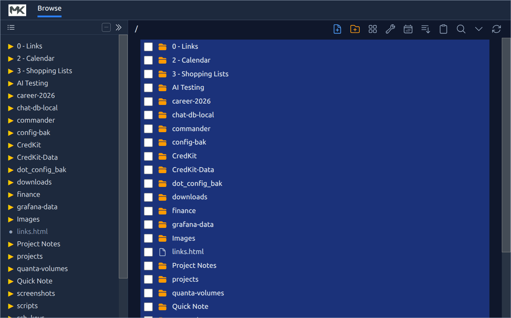
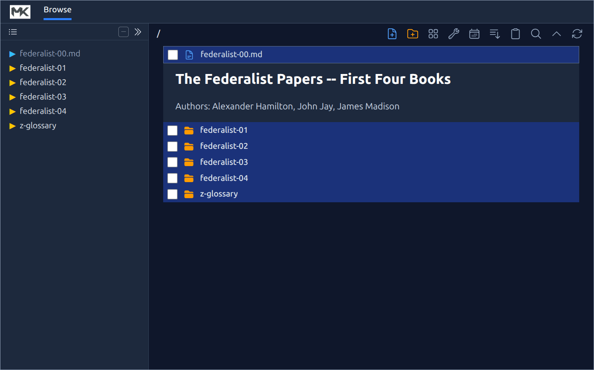
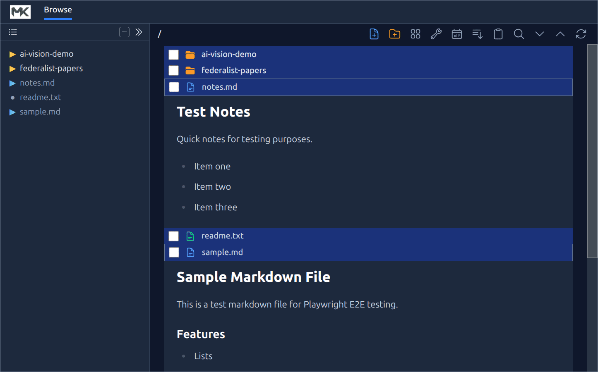

# MkBrowser Animated GIFs

## How to Create a File

## How to Use File Explorer

## How to Use Document Mode

## How to Chat with an AI

## How to use AI Vision

## How to do Simple Search

## How to do Advanced Search

## How to use LaTeX

## How to create Mermaid Diagrams

## How to Generate a PDF

