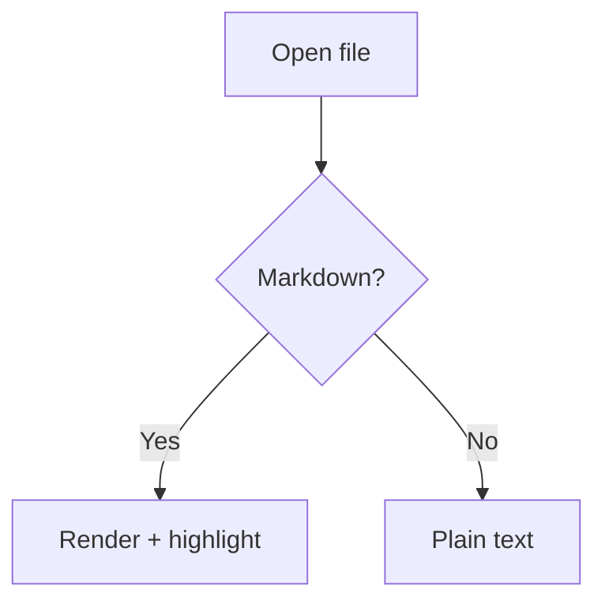

# Markdown Syntax Sample

A test document exercising every Markdown construct the editor colors. Open it in the
**editor** (not the rendered view) to check syntax highlighting. Toggle **Show Properties**
to see the front matter block above.

Across every section below, the rule is the same: **markers recede, content stands out.**
Every `#`, `*`, `-`, `>`, backtick and `~~` should render in dim grey.

## Headings

The six levels each get their own color, on top of the existing per-level size ramp.

# Heading level 1
## Heading level 2
### Heading level 3
#### Heading level 4
##### Heading level 5
###### Heading level 6

Setext headings are colored the same as their ATX equivalents, but do *not* get the size
bump (the size plugin only matches `#`-style headings):

Setext heading level 1
======================

Setext heading level 2
----------------------

## Inline emphasis

Plain paragraph text for comparison, then **bold text**, then *italic text*, then
***bold italic text***, then ~~struck-through text~~, then `inline code`.

Bold and italic share one color, told apart by weight vs. slant. Struck text is muted
but still readable. Alternate markers: __bold with underscores__ and _italic with
underscores_.

Escapes should stay literal, not turn into emphasis: \*not italic\*, \# not a heading,
and a literal backslash \\ here.

Entities: &copy; &amp; &lt;tag&gt; &mdash; and a hard break at the end of this line,  
made with two trailing spaces.

## Lists

Bullet list bodies deliberately stay the default text color — only the bullet dims:

- First bullet item
- Second bullet item
  - Nested bullet item
    - Deeper nested item
- Third bullet item

Ordered lists behave the same way:

1. First ordered item
2. Second ordered item
   1. Nested ordered item
   2. Another nested item
3. Third ordered item

Task lists (GFM) — the checkbox itself is colored:

- [ ] Unchecked task
- [x] Checked task
- [ ] Task with **bold** and `code` inside

## Blockquotes

> A blockquote body reads muted and italic.
> It continues across multiple lines.
>
> > A nested blockquote goes one level deeper.

> A quote containing **bold**, *italic*, and `code`.

## Links and images

An [inline link](https://example.com), an [inline link with title](https://example.com "Example
Title"), and a [reference link][ref-link].

An autolink in angle brackets: <https://example.com>

A bare URL (GFM autolink): www.example.com and an email: someone@example.com

An image: 

[ref-link]: https://example.com "Reference Link Title"

## Tables

GFM tables — header cells are colored, pipes and the delimiter row dim:

| Left aligned | Centered | Right aligned |
| :----------- | :------: | ------------: |
| Widget       | Small    | 3             |
| Gadget       | Medium   | 42            |
| Doohickey    | Large    | 1250          |

A table with inline formatting inside cells:

| Feature | Syntax | Status |
| --- | --- | --- |
| Bold | `**text**` | **done** |
| Italic | `*text*` | *done* |
| Strike | `~~text~~` | ~~done~~ |

## Code

Inline `code` sits in the same color family as fenced code blocks.

A JavaScript block (the language label after the fence is highlighted too):

```js
const greeting = 'hello';
function greet(name) {
  return `${greeting}, ${name}!`;
}
```

A Python block:

```python
def greet(name: str) -> str:
    return f"hello, {name}!"
```

A shell block:

```bash
echo "hello" | tr 'a-z' 'A-Z'
```

A fence with no language:

```
plain preformatted text
  with indentation preserved
```

An indented code block:

    indented four spaces
    also preformatted

## Horizontal rules

Text above the rule.

---

Text between rules.

***

Text below the rule.

## App-specific decorations

These come from our own plugins and should still win over syntax coloring.

Hashtags — `#p1` is orange, `#p2` is yellow, and every other tag is sky blue:

Priority one #p1 and priority two #p2 and regular tags #markdown #demo #sample-tag

Dates use `MM/DD/YYYY` and render green (hover for the tooltip). Note the ISO form is
*not* decorated:

- A plain date: 07/16/2026
- A date with time: 07/16/2026 3:30 PM
- A date with seconds: 12/25/2026 11:45:30 AM
- Not decorated (wrong format): 2026-07-16

## Math

Inline math: $E = mc^2$ and $\sqrt{x^2 + y^2}$.

A math block:

$$
\int_{-\infty}^{\infty} e^{-x^2} \, dx = \sqrt{\pi}
$$

## Mermaid



## Inline HTML

Markdown-embedded HTML keeps the code-token colors:

<div align="center">
  <strong>Centered bold HTML</strong>
</div>

Inline <em>HTML emphasis</em> and <code>HTML code</code> mixed into a paragraph.

<!-- An HTML comment, which should read as a comment. -->

## Mixed torture test

A paragraph with **bold `code` inside**, *italic with a [link](https://example.com)*,
~~struck **bold**~~, a #hashtag, a date 07/16/2026, and `code with **literal asterisks**`
that must not turn bold.

> A quote with a task-like line and a table pipe | inside it.

1. An ordered item with **bold**, a [link](https://example.com), and `code`
   - A nested bullet with ~~strikethrough~~
     ```js
     const nested = 'code block inside a list';
     ```
2. A final item.
